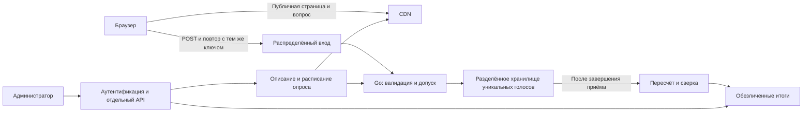

Рабочие заметки по архитектуре голосования — обновлено 10.09.2026.

Подробное актуальное описание реализации и целевого масштаба — [docs/architecture.md](docs/architecture.md), с воспроизводимой арифметикой. Ниже сохранена прежняя модель страницы с тремя GET и бюджетом 50+1 KiB. Текущий UI использует пять GET; в новом документе это учтено вместе с ограничением `no-store` и источником серверного времени. Приведённые ниже исторические стоимостные примеры не являются сметой реализованного сервиса.

Статус: пользователь согласовал схему атомарного приёма с ID браузера и переход к разработке. Реализован первый вертикальный срез на Go/PostgreSQL; описание запуска и фактических гарантий — в [README](README.md) и [ADR](docs/decisions.md). После замечания о масштабе подготовлен [пересмотр в пользу пакетного журнала](docs/architecture-revision.md), затем по запросу пользователя реализован и испытан изолированный прототип `internal/votelog` + `cmd/logbench`. Основной PostgreSQL API сохраняется. [Результаты](docs/log-results.md) включают успешные и неудачные HTTP/direct-нагрузки и ограничения доступности при отказах; [методика](docs/log-benchmark.md) описывает границы проверки. Ниже сохранена историческая количественная модель и сравнение вариантов; это не конфигурация уже развёрнутой распределённой инфраструктуры. Расчёты, приватность и отказы независимо проверены агентами. Исходный документ: [go-poll-architecture-prompt.md](go-poll-architecture-prompt.md). Готовность к 100 млн/мин, география и защита от потери зоны/региона пока не подтверждены.

Зафиксированные требования:

- Один активный опрос, 100 млн фактических голосующих за 60 секунд, равномерное поступление голосов. Конверсия уже учтена.
- Пользователь назвал 100 млн вероятной средней загрузкой: это расчётная база, верхняя граница числа голосующих пока неизвестна.
- Только выбор вариантов: A/B, single choice, multiple choice; свободный текст исключён по указанию пользователя. Предел числа вариантов и размера ответа ещё не задан.
- Закрытие допуска новых голосов через 60 секунд после начала. Пользователь согласовал: допуск сервером в 59,9 с и завершение записи в 60,2 с позволяют учесть голос.
- Приоритет — минимальные потери. Быстрый подсчёт результатов не является существенным требованием.
- События редкие, подготовка заранее возможна; сопровождение командой senior-инженеров. Бюджет неизвестен.
- Go, анонимное голосование, базовая дедупликация, защищённые административные операции. Пользователь разрешил хранить случайный идентификатор опроса без заданного предельного срока, если этот механизм выбран. Это явное уточнение исходного ограничения данных; оно не разрешает сбор IP, fingerprint или сквозного идентификатора человека.
- Дедупликация нужна для обычного повторного захода и повторного ответа в течение минуты; её стоимость на пути приёма должна быть минимальной. Защита от намеренной смены браузерного состояния не входит в основной сценарий.

Открытые решения: география; потеря зоны или региона; измеримые цели доступности и задержек; верхняя граница нагрузки; размеры ответов. Правило «первый надёжно принятый выбор окончательный» используется как рабочее допущение для запрета повторного ответа; отдельное редактирование голоса пока не согласовано. Идентификатор разрешён, ограничение хранения в 24 часа не требуется. Конкретные сроки хранения технических записей определяются потребностями восстановления и пересчёта. Три зоны одного региона остаются предложением.

IP технически можно передать в теле запроса или вернуть в HTTP-ответе. Адрес, сообщённый клиентом, нельзя считать достоверным. Сетевой вход видит адрес непосредственного соединения; за CDN это может быть адрес прокси. Заголовки происхождения принимаются только от настроенных доверенных прокси: [RFC 7239, §8.1](https://www.rfc-editor.org/rfc/rfc7239.html#section-8.1).

Общий IP объединяет разных участников за NAT/CGNAT, а смена адреса позволяет одному участнику выглядеть новым. Ограничение «один IP — один голос» создаст ложные отказы и противоречит приоритету минимальных потерь: [RFC 6269, §13](https://www.rfc-editor.org/rfc/rfc6269.html#section-13), [RFC 8981](https://www.rfc-editor.org/rfc/rfc8981.html). Хеширование IP сохраняет эти проблемы и всё равно создаёт состояние, связывающее попытки; это вывод из способа сравнения.

Рекомендация для базовой защиты — случайный 128-битный идентификатор браузерного состояния только для одного опроса. Он сохраняется при первом открытии страницы, передаётся вместе с голосом и повторно используется после перезагрузки, повторного захода и тайм-аута. Хранение такого идентификатора пользователь разрешил. Он не устанавливает уникальность человека: другой браузер, профиль, устройство, встроенный браузер мессенджера или очистка данных создадут другое состояние; общий профиль может объединить нескольких людей. Число уникальных принятых ключей — число различимых браузерных состояний, которое нельзя выдавать за измеренное число физических лиц или исправлять неизвестным коэффициентом. Расчётная аудитория 100 млн фактических голосующих при этом не уменьшается.

Для согласованности вкладок предлагается локальная IndexedDB-запись poll_id → token на одном origin. Короткая readwrite-транзакция читает запись и создаёт её при отсутствии; запрос голосования начинается только после завершения транзакции. Пересекающиеся readwrite-транзакции одного object store выполняются последовательно: [IndexedDB 3.0, transaction scheduling](https://www.w3.org/TR/IndexedDB/#transaction-scheduling). Простая последовательность чтения и записи localStorage не гарантирует защиты от гонки первого открытия: [HTML Standard, Web storage](https://html.spec.whatwg.org/multipage/webstorage.html#introduction). Токен из 16 случайных байт создаётся через [Web Cryptography, getRandomValues](https://www.w3.org/TR/webcrypto/#Crypto-method-getRandomValues). Браузерные спецификации проверены 10.09.2026. Все публичные ссылки на опрос должны вести на один origin; разные домены не разделяют автоматически это состояние.

Создание и чтение локального ID не добавляют HTTP-запросов. После полученного подтверждения локальная отметка позволяет при повторном открытии сразу показать прежний исход и избежать лишнего POST. При неопределённом исходе сохраняются тот же ID и выбор; локальная отметка не заменяет серверную уникальность. Если браузерное хранилище недоступно, нельзя обещать устойчивость при повторном открытии: предлагается разрешить попытку с ID текущей страницы, явно учитывая ослабленную дедупликацию и не подменяя её IP/fingerprint. Это предложение по приоритету доступности, подлежащее проверке на целевых браузерах.

Для первого голоса в исторической атомарной схеме предлагается один вызов хранилища: создать запись по уникальному (poll_id, token), только если её ещё нет. Предварительное чтение и отдельный сервис проверки дублей не требуются. Уникальность при этом выполняет реальную работу внутри хранилища; нулевую потерю пропускной способности относительно безусловной записи обещать нельзя. На испытаниях нужно сравнить устойчивый throughput и p95/p99 условных записей с безусловными при одинаковой сохранности, распределении и доле повторов. Вариант журнала с дедупликацией после закрытия уже реализован отдельным прототипом; его текущий статус и результаты указаны выше.

Сам бинарный ID добавляет 16 B к записи, или 1,6 GB на 100 млн голосов до репликации и индексов. Это часть ранее принятого размера 64–256 B, а не дополнительное слагаемое поверх него. Текстовая передача ID в HTTP больше 16 B. В основном потоке по-прежнему 1,667 млн новых записей/с; дополнительные HTTP-попытки и запросы проверки исхода считаются отдельно.

Количественная база: N = 100 000 000; T = 60 с; λ = N/T ≈ 1 666 667 уникальных голосов/с. Здесь и далее GB/TB десятичные, KiB = 1024 B, если не указано иначе.

Для расчёта HTTP предположим на человека один HTML, один общий bundle, один GET вопроса и один POST. Загрузки страниц также условно распределены по минуте; из равномерности голосов это не следует. Клиентская генерация идентификатора в этой модели не требует отдельного запроса. При серверной выдаче добавится до 100 млн запросов. Админка и запросы проверки неопределённого исхода учитываются отдельными слагаемыми.

Пусть r — среднее число дополнительных POST на исходный голос; h — доля попаданий GET в кеш. Тогда GET = 3λ, POST = λ(1+r), HTTP всего = λ(4+r), origin = λ(1+r)+3λ(1−h). Синхронные повторы могут дать пик выше оценки по среднему r.

| Повторы POST | POST, млн/с | HTTP всего, млн/с | Origin при h=99%, млн/с | Origin при h=99,9%, млн/с |
|---|---:|---:|---:|---:|
| 0% | 1,667 | 6,667 | 1,717 | 1,672 |
| 10% | 1,833 | 6,833 | 1,883 | 1,838 |
| 30% | 2,167 | 7,167 | 2,217 | 2,172 |

Если весь HTTP проходит через CDN, он видит 400–430 млн запросов за событие. При полном отсутствии кеша origin получает весь поток. Объединение одновременных запросов одного объекта может защитить origin, но эффект зависит от распределения по точкам присутствия и ключей кеша. Публичные объекты должны быть одинаковыми для всех, без персональных cookies в ключе кеша и без выдачи персонального Set-Cookie из общего кеша. POST и ответы о статусе конкретного голоса должны обходить кеш. Обновление общих объектов планируется до старта.

Для контроля нагрузки пока рассматривается условный конверт: 1,667 млн новых голосов/с и до 2,167 млн POST/с с повторами, плюс GET. Это не утверждённый предел и не запас на увеличение аудитории сверх 100 млн. Если N увеличится в k раз, соответствующие объёмы и скорости умножаются на k. Всплески голосов из первого этапа остаются проверками за пределом основной равномерной модели, а не подтверждённым требованием.

Допущения по размерам: HTML+bundle = 50 KiB сжатых, вопрос = 1 KiB, payload POST = 100–300 B. Ограничение вариантов ещё может изменить размеры. Нормализованная запись выбора может быть меньше JSON-запроса.

| Величина | Формула / допущение | За событие | Средняя скорость |
|---|---|---:|---:|
| Тела GET клиентам | N × 51 KiB | 5,2224 TB | 696,32 Gbit/s исходящих |
| Тела GET от origin при h=99% | Предполагается h=99% для каждого объекта | 52,224 GB | 6,963 Gbit/s |
| Тела GET от origin при h=99,9% | h=99,9% для каждого объекта | 5,2224 GB | 0,696 Gbit/s |
| POST, входящий обмен | Условно 0,7–2 KiB на попытку, r=0 | 71,68–204,8 GB | 9,557–27,307 Gbit/s |
| POST, исходящий обмен | Условно 0,3–1 KiB на попытку, r=0 | 30,72–102,4 GB | 4,096–13,653 Gbit/s |
| POST, оба направления | Суммарно 1–3 KiB на попытку, r=30% | 133,12–399,36 GB | 17,749–53,248 Gbit/s |
| Нормализованные голоса | N × 64–256 B | 6,4–25,6 GB | 106,67–426,67 MB/s |
| Три полные копии голосов | 3 × объём записи | 19,2–76,8 GB | 320–1280 MB/s суммарной записи |
| Две дополнительные передачи репликации | 2 × объём записи | 12,8–51,2 GB | 1,707–6,827 Gbit/s |

Размеры POST — гипотеза с HTTP-заголовками, TLS records и транспортным framing на переиспользуемом соединении. Полезный payload уже включён. TLS handshakes, повторы пакетов и служебный протокол хранилища добавляются отдельно. Заголовки и транспорт GET не входят в 51 KiB: каждый дополнительный 1 KiB обмена на GET даёт 307,2 GB на 300 млн GET. Вход/выход этого overhead следует измерить отдельно.

Если все страницы открываются за 10 с, те же тела GET требуют 4,178 Tbit/s, а запросы GET — 30 млн/с, даже при равномерных голосах. Предварительное открытие страницы снизит совпадение этого потока с записью голосов, если такой сценарий подтвердится.

Закон Литтла для POST: L = R_POST × среднее время в выбранной границе системы. p95/p99 вместо среднего подставлять нельзя.

| Среднее время | Одновременные POST при r=0 | При r=10% | При r=30% |
|---|---:|---:|---:|
| 0,1 с | 166 667 | 183 333 | 216 667 |
| 0,3 с | 500 000 | 550 000 | 650 000 |
| 1 с | 1 666 667 | 1 833 333 | 2 166 667 |

Число открытых соединений отдельно: L_conn = скорость новых соединений × средняя длительность соединения. Например, условно одно новое соединение на участника, открытое 30 с, даёт 50 млн соединений на распределённом внешнем входе. Это не число соединений Go-origin: CDN может переиспользовать и мультиплексировать собственные. При одном handshake на участника потребуется 1,667 млн handshake/с; для handshake размером b байт обмен составит N×b. Нужны отдельные квоты и измерения TLS, DNS, балансировщиков, сетевых портов и клиентских генераторов.

CPU: cores ≥ R × измеренные CPU-секунды на запрос / целевая загрузка ядра. Память: L × измеренные байты на запрос + L_conn × байты на соединение + пулы и буферы. Для 100 млн идентификаторов сами 16 байт ключа составляют 1,6 GB, но таблицы, индексы, allocator, journal и реплики увеличат объём. Отдельная база дедупликации не обязательна, если уникальная запись голоса выполняет обе задачи. Физическая запись = логические байты × репликация × измеренное усиление записи с учётом индексов и журнала; коэффициента пока нет.

Число экземпляров вычисляется после измерения устойчивого q при целевой задержке. Для одинаковых трёх зон с сохранением обслуживания при потере одной: n_zone ≥ ceil(sR/(2q)), n_total = 3n_zone, где s>1 оставляет дополнительный запас. При s=1 общая мощность составляет минимум 1,5R, но после потери зоны запаса для опустошения очереди нет. Формула относится к независимо масштабируемому уровню; размещение и мощность реплик хранилища проверяются отдельно. Для разделов используются их собственные измеренные q и распределение ключей, а не RPS приложения.

Пауза обработки на 5 с создаёт 8,333 млн ожидающих уникальных голосов (0,533–2,133 GB логических записей), только если надёжный приём всё это время продолжает работать. При восстановленной мощности μ>λ время опустошения = 5λ/(μ−λ): 20 с при μ=1,25λ, 10 с при 1,5λ, 5 с при 2λ. Без надёжного буфера это отказы и неопределённые исходы, а не сохранённая очередь. Возможность позже считать результаты не исправляет недоступность приёма.

Два варианта с разрешённым идентификатором; конкретные гарантии отказов и масштаб ещё требуют проверки:

| Критерий | А: атомарная уникальная запись голоса | Б: надёжный журнал попыток, обработка позже |
|---|---|---|
| Подтверждение | Выбор надёжно принят, повтор не создаст другой голос | Попытка надёжно сохранена; победитель среди конфликтующих выборов может быть ещё неизвестен |
| Дедупликация | Уникальный ключ и содержимое голоса сохраняются одной операцией | Повторные попытки сохраняются; обработчик выбирает один ответ по устойчивому порядку |
| Задержка | Ожидание атомарной записи и требуемой репликации | Ожидание записи в реплицируемый журнал; проверка окончательного статуса может добавлять запросы |
| Масштаб | Шарды по идентификаторам внутри опроса; нагрузку условных записей необходимо измерить | Разделы по идентификаторам; преимущество последовательной записи и batching является гипотезой до измерений |
| Отказоустойчивость | ACK после требуемой сохранности; при недоступной репликации новые подтверждения прекращаются | Те же требования к ACK журнала; остановка обработчика не мешает приёму, пока достаточно места |
| Восстановление | Пересчёт из полного набора уникальных записей | Воспроизведение журнала, восстановление порядка и дедупликации |
| Стоимость | Индексы/условные записи; возможна оплата операций или аренда кластера | Журнал, реплики, повторы, обработчики и их состояние; возможность batching не доказывает меньшую итоговую цену |
| Поддержка | Меньше независимых состояний и переходов | Больше сценариев replay, checkpoint и определения финального исхода |

Предварительная рекомендация — А как более простой по корректности. Скорость результатов позволяет считать их после закрытия без общего счётчика на каждый POST. Вариант Б стоит предпочесть при измеренном преимуществе или дополнительных требованиях к воспроизведению потока. Обе схемы ещё требуют согласования гарантий и проверки масштаба.

Это логическая схема варианта А; внешний вход и CDN могут быть одной услугой. Конфигурация опроса заранее распространяется в Go и замораживается на событие, чтобы не читать административную БД на каждом голосе. Административные соединения и вычислительные ресурсы изолируются от массового приёма. Партиционирование должно учитывать случайный идентификатор: один poll_id или один ключ счётчика не распределит нагрузку 100 млн голосов. Публичного polling результатов и WebSocket в базовом потоке нет.

Предлагаемая последовательность: клиент получает общую конфигурацию; создаёт/читает идентификатор опроса; отправляет выбранные option_id; сервер проверяет размер, допустимые варианты и дедлайн; атомарно создаёт уникальную запись; отвечает после требуемой сохранности. По рабочему правилу первый надёжно принятый нормализованный выбор окончательный. Повтор того же выбора возвращает прежний результат; другой выбор с тем же ключом — конфликт, без второго голоса. При двух конкурентных разных ответах победитель определяется атомарной фиксацией, а не временем нажатия в браузере.

Не использовать раздельное «занять ключ дедупликации → сохранить голос» или обратный порядок без атомарности: первый оставляет занятый ключ без голоса после сбоя, второй допускает двойной учёт. В варианте А запись голоса сама является отметкой уникальности. Потерянный HTTP-ответ после commit не отменяет запись. Поздний повтор уже принятой операции возвращает её исход; отсутствие записи при незавершённой операции не следует немедленно объявлять окончательным отказом.

Для результатов предлагается полный пересчёт после закрытия допуска и разрешения всех ранее допущенных записей. Частичный результат каждого раздела публикуется заменой по ключу (версия пересчёта, раздел), а не повторным увеличением общего счётчика. Финальная версия публикуется только после сверки всех разделов. Для single choice сумма по вариантам равна числу принятых голосов; для multiple choice отдельно сохраняется число участников, сумма выбранных вариантов может быть больше. После удаления исходных записей независимый пересчёт отдельных голосов невозможен — этот предел должен быть согласован.

Согласованное правило дедлайна: T_close = T_start + 60 с прекращает допуск новых операций, но ранее допущенные операции могут завершить надёжную запись после него. Допуск относится к полностью полученному и проверенному содержимому конкретного ответа, связанному с серверным временем/порядком. Клиентское время и время открытия страницы не являются доказательством. Запрос, допущенный в 59,9 с и записанный в 60,2 с, учитывается; новая операция, впервые пришедшая после закрытия, не принимается, даже если её ID создан раньше. До надёжной записи операция остаётся неподтверждённой и может быть потеряна при падении процесса.

Если нужно переживать падение процесса после допуска, но до записи, свидетельство допуска вместе с содержимым должно сохраниться вне этого процесса: это добавляет надёжный журнал допуска либо другой протокол восстановления. Просто RAM-очередь такой гарантии не даёт. Неизменяемый дедлайн можно заранее распространить по Go-инстансам без обращения к общей строке на каждый голос. При этом допустимая погрешность серверных часов и поведение при её превышении ещё согласуются; абсолютную физическую одновременность независимых часов не обещаем. Для последних отправок окно наблюдения подтверждения выходит за момент закрытия.

Поздний повтор уже сохранённого голоса возвращает прежний исход. Если первая запись ещё выполняется, отсутствие строки пока не является доказательством её отказа: клиенту доступен исход «пока неизвестно» и последующая проверка. Новый обработчик не может разрешить новую запись после закрытия только по наличию ID. Ранее допущенная операция под управлением сервиса может завершить запись после разрыва HTTP-соединения в пределах ограниченного срока исполнения; это само по себе не защищает от смерти процесса.

Финальные результаты требуют доказательства завершённости входа по всем разделам: старые допущенные операции должны быть завершены либо окончательно отсечены от записи. Тайм-аут сетевого вызова не доказывает такого отсечения. Протокол завершения/барьеров на уровне выбранного хранилища и предельный срок исполнения ещё нужно определить; простого ожидания фиксированных секунд недостаточно. Неограниченный срок хранения ID не даёт бессрочного права дозаписать голос после закрытия.

Целевые показатели ещё обсуждаются: 0 потерянных подтверждённых голосов при явно выбранном наборе отказов; отдельно доля допустимых голосований без надёжного принятия и доля без полученного клиентом подтверждения. Ранее предложенные p95≤1с, p99≤3с и 99,9% подтверждений пользователь не утвердил. На 100 млн доля неуспеха 0,1% означает 100 тыс., 0,01% — 10 тыс., 0,001% — 1 тыс. голосований. Запрет потери подтверждённых не заменяет метрику доступности новых приёмов.

| Сбой | Подтверждённые голоса | Новые/неподтверждённые | Восстановление и проверка |
|---|---|---|---|
| Go-процесс | Сохраняются при корректном ACK хранилища | Тайм-аут, повтор с прежним ключом; RAM-допуск может исчезнуть | Проверка статуса и атомарная дедупликация |
| Узел/зона хранения | Зависит от выбранной репликации и порядка ACK | Возможна пауза; оставшимся зонам нужен запас | Проверка failover, отсутствия потерь и двойного учёта |
| Недоступен необходимый кворум | Сохраняем прежнюю историю без небезопасного переключения | Подтверждения прекращаются | Восстановление связи; счётчик непринятых отдельно |
| Замедление/заполнение хранения | Уже принятые не удаляются ради новых | Ограниченные очереди и контролируемые отказы | Восстановление мощности, ограниченные повторы с jitter |
| Остановился подсчёт | Исходные записи сохраняются до согласованного удаления | Приём возможен независимо от подсчёта | Полный пересчёт и сверка |
| Потерян регион | Однорегиональная схема гарантии не даёт | Недоступность приёма | Для RPO=0 нужна сохранность вне региона до ACK |

Backpressure не должен выдавать успех за запрос в RAM. Ограничиваются очередь, число незавершённых записей и бюджет повторов. После тайм-аута клиент сохраняет ключ и выбор; состояние «исход пока неизвестен» отличается от явного отказа. После закрытия разрешена проверка существующей операции, а не новая попытка с новым выбором. IP-лимит не заменяет уникальность: отдельные широкие защитные ограничения не должны отрезать массовые общие сети. Численные тайм-ауты/бюджет повторов определяются после согласования географии и SLO.

Предварительная политика полей, только для обсуждения:

| Поля / место | Назначение | Предлагаемое хранение |
|---|---|---|
| poll_id, версия вопроса, option_id, расписание | Валидация и интерпретация результатов | Пока опрос/его результаты нужны администратору; конкретный срок ещё не задан |
| poll-scoped token + нормализованный выбор + доказательство допуска, если нужно | Уникальность, восстановление ответа, пересчёт | Пользователь не задаёт предельный срок для ID; политика технических записей охватывает повторы, восстановление, пересчёт и копии, конкретный срок будет выбран с архитектурой |
| Счётчики вариантов, общее число принятых, версия пересчёта | Обезличенные результаты | Срок хранения результатов согласовать |
| IP, fingerprint, User-Agent, сквозной идентификатор | Для подсчёта не нужны | Сохранение не предлагается; IP обрабатывается сетью для доставки |
| Метрики задержек/ошибок/очередей по ограниченным категориям | Диагностика | Предложение 30 дней, без идентификаторов и выбора участника |
| Учетные записи администраторов, роли, аудит действий | Защита управления | Отдельная политика администраторов; не смешивать с голосующими |

Хранение ID для корректности голосования не требует дублировать его в CDN/LB access logs, traces и метриках. IP/fingerprint/сквозные идентификаторы по-прежнему не сохраняются. Технические ID допустимы в необходимом источнике голосов, его журнале, репликах и согласованной процедуре восстановления; сроки всех копий учитываются в политике хранения. Строгого удаления через 24 часа теперь не требуется. Тем не менее логический TTL не означает немедленного физического удаления: например, DynamoDB удаляет истёкшие записи обычно в течение нескольких дней — [документация TTL](https://docs.aws.amazon.com/amazondynamodb/latest/developerguide/TTL.html). Эту особенность учитываем при выборе политики очистки, а не используем как повод заново запрашивать разрешение на ID.

Телеметрия: 430 млн строк по 500 B — 215 GB за событие без индексов и реплик. Предпочтительны агрегированные счётчики и гистограммы; выборочная диагностика должна удалять поля участия до записи. Идентификаторы голосующих не используются как метки. Согласованный срок исходных данных нельзя молча продлевать из-за неисправного подсчёта: пересчёт и восстановление должны укладываться в него либо условия заранее пересматриваются.

Проверка текущей документации и пример цен выполнены 09.09.2026. AWS ниже — иллюстрация стоимости и ограничений для обсуждения, не выбранный провайдер. Для управляемых DynamoDB/CloudFront версия сервера пользователю не фиксируется; использованы текущие Developer Guide и тарифы. Для RFC указаны номера. Реальный вертикальный срез использует Go и pgx из go.mod и PostgreSQL 16+; этот AWS-пример не является счётом за текущий локальный запуск.

- DynamoDB поддерживает условную запись без перезаписи существующего ключа: [Condition expressions](https://docs.aws.amazon.com/amazondynamodb/latest/developerguide/Expressions.ConditionExpressions.html). HTTP 200 от записи означает durable persistence; это не является нашим измерением доступности при отказе: [Read consistency](https://docs.aws.amazon.com/amazondynamodb/latest/developerguide/HowItWorks.ReadConsistency.html). Данные реплицируются между зонами региона: [Partitions](https://docs.aws.amazon.com/amazondynamodb/latest/developerguide/HowItWorks.Partitions.html).
- Новая on-demand таблица имеет стартовый warm throughput 4 тыс. записей/с; обычная табличная квота — 40 тыс. единиц записи/с, увеличение требуется заранее: [On-demand](https://docs.aws.amazon.com/amazondynamodb/latest/developerguide/on-demand-capacity-mode.html), [Quotas](https://docs.aws.amazon.com/amazondynamodb/latest/developerguide/ServiceQuotas.html). Название serverless не доказывает готовность к нашей минуте.
- Документированный предел раздела DynamoDB — 1000 write units/с: для 1,667 млн записей/с до 1 KiB арифметический минимум составляет 1667 физических разделов без запаса. Это нижняя граница по документации, не рекомендация числа шардов приложения и не бенчмарк: [Partition key design](https://docs.aws.amazon.com/amazondynamodb/latest/developerguide/bp-partition-key-design.html).
- Для CloudFront pay-as-you-go опубликованы обычные квоты 250 тыс. RPS и 150 Gbit/s на distribution; наша модель превышает обе. Документация отдельно исключает flat-rate plans из этих двух квот: [CloudFront quotas](https://docs.aws.amazon.com/AmazonCloudFront/latest/DeveloperGuide/cloudfront-limits.html). Условия конкретного тарифа и возможность подготовки нужного масштаба надо подтвердить до события.

Пример денежных составляющих, USD, без налогов, бесплатных квот и скидок; сценарий AWS US East (N. Virginia), CDN — США/Европа. Применимость провайдера и география пока не установлены.

| Статья | Расчётная оценка | Что ограничивает оценку |
|---|---:|---|
| 100 млн первоначальных записей DynamoDB Standard до 1 KiB | 100 × $0,625 = $62,50 | Без повторов, чтений, удаления, индексов и дополнительных транзакций |
| Первое увеличение warm throughput с 4000 до 1 666 667–2 166 667 writes/s | Δ × $0,00065 ≈ $1081–1406 | Условный тарифный расчёт; квоты и доступность ёмкости нужно подтвердить; повышение warm throughput и последующие события — разные статьи |
| CDN, тела GET около 5,2 TB | Около $400–450 при $0,085/GB | Округление и единицы биллинга; без заголовков, ACK, TLS, скидок и бесплатного объёма |
| CDN, 400–430 млн HTTPS | $400–430 США; $480–516 Европа | $0,010/$0,012 за 10 тыс.; без дополнительных функций |

Тарифы и правила расчёта: [DynamoDB pricing](https://aws.amazon.com/dynamodb/pricing/), [CloudFront pay-as-you-go](https://aws.amazon.com/cloudfront/pricing/pay-as-you-go/). Прогрев оплачивается по приросту warm capacity; обычная запись до 1 KiB стоит одну write request unit. Внутризонную репликацию управляемой услуги нельзя механически ещё раз умножать на три в этой строке счёта.

Эти статьи дают ориентировочно $2–2,5 тыс. для первого события с указанной подготовкой, но НЕ общую стоимость сервиса и не верхнюю границу бюджета. Дополнительно нужны Go-инстансы, балансировка, запросы к origin, подготовка чтений, сетевые соединения, межзонный трафик соответствующих компонентов, чтение/удаление данных, подсчёт, хранение, телеметрия, дежурство и испытания. Расчёт первоначальных записей не описывает стоимость повторного условного запроса и проверки его исхода.

Полная модель: C_event = C_prepare + Σ(число экземпляров × оплаченные часы × тариф) + C_requests + C_network + C_storage + C_compute_results + C_telemetry. Для каждого сетевого участка объём, направление, единица и тариф учитываются отдельно. Постоянная стоимость = минимальное размещение control plane/админки + хранение результатов + DNS/мониторинг + сохранённая резервная мощность. Фиксированный пиковый кластер между редкими событиями может быть дорогим; on-demand снимает оплату простоя операций, но не решает подготовку и квоты.

Для журнала/самостоятельного хранилища сравнивается та же полная формула с дисками, репликацией, часами прогрева и обслуживания; обещать меньший счёт до выбора региона и измеренного q нельзя. Подготовка заранее позволяет арендовать мощность до события и уменьшить после завершения обработки; время аренды не равно одной минуте.

Нагрузочное испытание: C_test = Σ C_прогона + генераторы + их исходящий трафик + подготовка + анализ. Полный прогон 100 млн уникальных голосов снова создаёт сопоставимые объёмы; тест только POST исключает основную раздачу страницы, но не доказывает готовность полного пути. Прежде чем запускать платные ресурсы и полномасштабные испытания, нужен конкретный согласованный план и бюджет. Для выполненных локальных экспериментов созданы стенды PostgreSQL и Kafka; платные распределённые ресурсы не создавались.

До события: подтвердить квоты и наличие мощности; заранее распространить и прогреть публичные объекты и конфигурацию; проверить репликацию, распределение ключей и время; назначить дежурство; запретить плановый rollout в окно приёма. После закрытия сначала завершить ранее допущенные операции и сверку, затем уменьшать мощность. Rollback не должен менять смысл ключа уникальности и правила выбора победителя.

Приёмка должна раздельно учитывать логические голоса, HTTP-попытки, durable принятия и реально полученные клиентом подтверждения. После согласования нужны проверки одного массового опроса, конкурентных дублей, разных ответов с одним ключом, потерянного ACK, сбоя до/после commit, потери зоны, replay пересчёта, заполнения очереди и границы 60 секунд. Генераторы должны посылать по заданному расписанию, учитывать опоздания отправки и собственные ограничения, чтобы замедление генератора не скрывало перегрузку сервиса. Локальный вертикальный срез и доказательство 100 млн за минуту имеют разные критерии готовности.

Следующий этап после работающего PostgreSQL-среза и локальных испытаний журнала: устранить ограничения доступности при отказах, уточнить географию и переживаемые отказы, зафиксировать измеримые цели потерь и предел нагрузки, измерить устойчивую производительность на отдельных машинах и подготовить конкретный план размещения с бюджетом. API, данные, ADR и локальные тесты уже добавлены. В основном сервисе публичный API вопроса пока не кешируется из-за серверного времени в ответе, подсчёт выполняется на одной БД; в прототипе журнала нет интеграции результатов с админкой и распределённого назначения владельцев. Географическая репликация не настроена. Эти различия с расчётной моделью должны быть устранены/согласованы до утверждения готовности масштаба.
