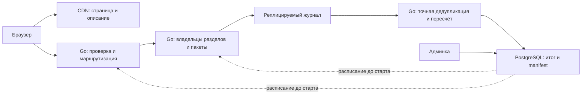

> Исторический документ предыдущего этапа. Он не описывает текущий запуск этой ветки. Актуальная реализация PostgreSQL + Kafka: [postgres-kafka.md](postgres-kafka.md); отдельная работающая версия Go + файлы: [ветка simple-files](branches.md).

Пересмотр архитектуры массового приёма, 10.09.2026.

**Пакетный реплицируемый журнал попыток и последующая точная дедупликация реализованы и испытаны как изолированный архитектурный прототип по запросу пользователя.** `internal/votelog` и `cmd/logbench` проверяют допуск Go, транзакционные пакеты Kafka, закрытие, восстановление и точный пересчёт. Основной Go/PostgreSQL-сервис сохраняет прежний публичный API. [Все результаты, включая неудачные прогоны](log-results.md), [методика и команды](log-benchmark.md).

Ниже описаны целевая схема и её расчёты. В прототипе результат и manifest выдаются в JSON; публикация в административную PostgreSQL, распределённое назначение владельцев и публичное восстановление квитанций ещё не реализованы. Брокеры и генератор работают на одном компьютере. Локальные HTTP и direct-профили имеют разный объём работы, доступность при отказе остаётся нерешённой задачей; эти испытания не подтверждают целевые 100 млн голосов/мин или независимые зоны отказа.

Ранее основной вариант предполагал масштабирование атомарной записи по физическим группам. Таблицы с условным throughput не обосновывают, что сотни PostgreSQL-групп — разумное решение. Даже наивное деление 1 666 667 / 6000 даёт 278 групп, или 834 экземпляра БД с тремя копиями, до повторов и резерва. Это аргумент пересмотреть путь записи, а не план развёртывания. Локальные 6000/с не являются измеренным пределом PostgreSQL: генератор, приложение и три БД делили компьютер; часть слотов не отправлялась. [Фактические измерения](load-tuning.md).

Текущий путь выполняет для каждого голоса SQL, работу уникального индекса, ограничения и блокировки, ожидание репликации, затем отдельные SQL-проверки WAL. Последние нужны из-за проверенных неопределённых исходов SyncRep; просто удалить их нельзя. Увеличение очереди не устраняет стоимость этого пути, а PostgreSQL уже может объединять физические flush нескольких транзакций: формула «один голос = один отдельный fsync» тоже неверна. Следующий эксперимент должен менять способ записи, а не только размер очереди.

Предлагаемый поток:

Опрос, варианты, расписание и версия маршрута готовятся заранее и загружаются в Go. Каждый голос не обращается к PostgreSQL за метаданными. `hash(poll_id, token) mod P` направляет все попытки браузерного ID в один неизменный раздел. Один `poll_id` как единственный ключ распределения создал бы горячий раздел. P фиксируется до события; владельцы и лидеры могут меняться с восстановлением и запретом записи прежнего владельца. Один Go-процесс обслуживает несколько логических владельцев: отдельная партиция не требует отдельного процесса, сервера или кластера.

Владельцы накапливают ограниченные пакеты; кандидат — Apache Kafka с распределением трёх копий каждого раздела по трём зонам одного региона. Синхронная запись между регионами пока не предлагается без географии и требований к отказу региона. Контроллеры и служебные журналы также требуют отказоустойчивого размещения. При потере административной БД уже подготовленное событие может продолжать приём; публикация результатов подождёт восстановления.

После завершения приёма Go-обработчик читает подтверждённые записи каждого раздела по порядку. Для полного `(poll_id, token)` учитывается первый допустимый выбор; последующие записи не увеличивают результат. Это точная дедупликация браузерных ID, а не доказательство уникальности физического человека. Случайный ID остаётся ограничен опросом; IP, fingerprint, User-Agent в журнал не добавляются. Порядок offset определяет победителя конкурентных попыток, а не минимальное время от разных серверов. Kafka producer idempotence не заменяет такую проверку.

В прототипе реализован полный пересчёт закрытых разделов в новый результат и manifest; повторный запуск заново читает журнал и не прибавляет голоса к предыдущим счётчикам. Целевая публикация связывает версию опроса, маршрута, конечные offsets и результаты всех разделов; PostgreSQL должна атомарно публиковать готовую версию после завершения всех частей. Эта интеграция ещё не выполнена. Исходный журнал хранится до окончания восстановления и аудита, а не 60 секунд. Compaction исходных попыток по token непригодна: она оставляет последний выбор, хотя нужен первый. Размер состояния дедупликации, архива и срок хранения задаются отдельно.

Арифметика ниже воспроизводится командой `python3 scripts/log_capacity_model.py`. Это расчёт требований, не результат нагрузочного тестирования Kafka. GB и MB десятичные. Сжатие заранее не учитывается.

| Показатель | Формула | Значение |
|---|---|---:|
| Фактические уникальные голоса | 100 000 000 / 60 | 1 666 667/с |
| Попытки с условными 20% повторов | 1 666 667 × 1,2 | 2 000 000/с |
| Экспериментальная мощность с загрузкой до 80% | 2 000 000 / 0,8 | 2 500 000/с |
| События за один опрос с этими повторами | 100 000 000 × 1,2 | 120 000 000 |

20% повторов и 80% использования — новые явные допущения для сравнительного стенда, не уточнение требований пользователя и не снижение аудитории. В прежней модели рассматривались также 30% повторов: при них поток равен 2,167 млн/с и для того же 80% нужен предел 2,708 млн/с. Всплески сверх согласованного равномерного сценария требуют отдельного резерва. Число 2,5 млн/с не покрывает любой возможный профиль.

| Условный размер записи | Данные за событие, 120 млн попыток | Три копии | Вход при 2 млн/с | Вход при 2,5 млн/с | Запись трёх копий при 2,5 млн/с |
|---|---:|---:|---:|---:|---:|
| 96 B | 11,52 GB | 34,56 GB | 192 MB/s | 240 MB/s | 720 MB/s |
| 128 B | 15,36 GB | 46,08 GB | 256 MB/s | 320 MB/s | 960 MB/s |
| 256 B | 30,72 GB | 92,16 GB | 512 MB/s | 640 MB/s | 1920 MB/s |

Без повторов при 128 B получаем 12,8 GB за опрос и 213,3 MB/s. Событие содержит ID опроса, 128-битный token, маску выбранных вариантов, серверное время допуска и неизменяемые параметры опроса/маршрута; producer epoch передаётся протоколом Kafka. Диапазон 96–256 B — расчётный бюджет нормализованной записи; реализованный формат зафиксирован в [описании прототипа](log-benchmark.md). Транспорт, batch/transaction markers, индексы брокера, служебная репликация, повторные передачи и усиление дисковой записи требуют отдельного измерения. В 960 MB/s уже включены три копии: ещё раз умножать на три нельзя. Дополнительная передача двух копий при 128 B и 2,5 млн/с — 640 MB/s, или 5,12 Gbit/s, суммарно по кластеру.

Внешний HTTP поток больше внутренней записи: условные 1 KiB запроса × 2 млн/с дают 2,048 GB/s, или 16,384 Gbit/s входа до дополнительных сетевых расходов. Ответы, TLS, соединения и CDN считаются отдельно по [общей модели](architecture.md). При среднем времени подтверждения 50 ms получаем 100 000 одновременно незавершённых POST; при 200 ms — 400 000. Среднее время в законе Литтла нельзя подменять p99. Если Go тратит на попытку 25/100/250 µs CPU, поток 2 млн/с требует соответственно 50/200/500 полностью занятых ядер до резерва; это чувствительность к ещё не измеренной цене обработки. Журнал не отменяет масштабирование HTTP, TLS и маршрутизации.

Для одного кластера имеет смысл сравнить 128 и 256 разделов. При 2,5 млн/с:

| Разделы | Записей/с на раздел | Уникальных ключей за опрос | Записей за 20 ms при одном writer | Размер такого пакета при 128 B |
|---|---:|---:|---:|---:|
| 128 | 19 531 | 781 250 | 390,6 | 50 000 B |
| 256 | 9766 | 390 625 | 195,3 | 25 000 B |

Это средние при равномерном распределении; ни размер пакета, ни throughput не гарантированы. При 256 разделах и 5 ms выйдет около 49 записей на пакет. Если 100 ingress-процессов независимо пишут во все разделы, на комбинацию producer/partition приходится всего 0,49 нового события за 5 ms: полезное объединение разрушается. Поэтому нужен ограниченный набор writers, к которым Go направляет поток соответствующих ключей. Внутренний переход, CPU маршрутизатора, сбой writer и очереди входят в измерение. Нельзя обещать пакеты по 1000 записей каждые 5 ms без этой арифметики. Kafka также объединяет несколько partition batches в сетевой запрос, но это другая единица работы. [Batching в Kafka 4.3](https://kafka.apache.org/43/configuration/producer-configs/).

При 256 разделах RF=3 получается 768 копий разделов на общих брокерах. Например, 12 брокеров размещают в среднем 64 копии разделов каждый. Это геометрия размещения, не утверждение, что 12 серверов выдержат нагрузку.

Обратный расчёт задаёт, что должен подтвердить стенд. Пусть один из трёх равных наборов брокеров становится недоступен, а оставшиеся должны обеспечивать 2,5 млн попыток/с, включая выбранный резерв:

| Брокеров всего | После потери зоны | Требуемый логический поток на оставшийся брокер | Средняя запись трёх копий на брокер до отказа, 128 B |
|---|---:|---:|---:|
| 9 | 6 | 416 667/с | 106,7 MB/s |
| 12 | 8 | 312 500/с | 80 MB/s |
| 18 | 12 | 208 333/с | 53,3 MB/s |
| 24 | 16 | 156 250/с | 40 MB/s |

Значения RPS в таблице — критерии к узлам, **не известные показатели Kafka**. Производительность измеряется с фактическими обязанностями лидера и реплики, транзакциями пакетов, размерами сообщений, перекосом разделов и выбранным отказом; одного теста последовательной записи диска недостаточно. Сеть и работа лидера после потери зоны перераспределяются, а число доступных копий временно уменьшается: последний столбец описывает только состояние до отказа. Число контроллеров, Go-узлов, обработчиков и административная БД сюда не включены.

Если `q` — измеренная мощность одного оставшегося брокера при этих условиях, число брокеров в трёх равных зонах: `B = 3 × ceil(2 500 000 / (2 × q))`. Запас 20% уже включён в 2,5 млн; второй раз его не применяем. Геометрия и арифметика не доказывают приемлемую длительность переключения: даже достаточная установившаяся мощность после отказа может оставить пользователей без ответа в минутном окне. Измеряются недоступность, очередь и исход каждого ключа во время самого переключения.

Локальные отказные испытания показали необходимость отдельно рассчитывать погашение очереди: условная пауза с 25-й до 35-й секунды при 2 млн попыток/с потребует 2,8 млн/с после возобновления, чтобы ещё не допущенные попытки доставить до закрытия. Установившихся 2,5 млн/с для этого сценария недостаточно; ранее допущенные записи могут завершаться позже. Это уточнение расчётного резерва, а не измеренный предел кластера. [Наблюдавшаяся задержка и расчёт очереди](log-results.md).

Точное состояние дедупликации тоже не исчезает. Условные 32–64 B на уникальный ключ дают 3,2–6,4 GB суммарно, до таблицы хеширования/LSM, allocator, checkpoint и реплик. При 256 разделах это около 12,5–25 MB полезного состояния на раздел. Хранят полный token: сокращённый хеш или Bloom filter не могут окончательно отклонять голос из-за риска ложного совпадения. Если пересчитать 120 млн событий за 10 минут, нужен суммарный темп 200 000 событий/с; за минуту — 2 млн/с. Это требования к обработчикам, не измеренное время выполнения.

Контракт подтверждения меняется явно:

| Состояние | Что клиент вправе считать установленным |
|---|---|
| Допущено в ограниченную очередь Go | Сервер проверил время и форму; сохранность ещё не подтверждена |
| Новый `202 recorded` после commit пакета | Попытка сохранена согласно выбранной модели отказов; уникальный окончательный выбор может ещё определяться |
| Канонический исход после дедупликации | Первый допустимый выбор для этого ключа установлен; повтор не создаёт второй голос |
| Тайм-аут записи/commit | Исход неизвестен; это не доказательство отсутствия записи |

Текущий `201` означает уже окончательный выбор. Подменять его ACK журнала нельзя. Если прежний немедленный окончательный ответ обязателен, надо ждать решения обработчика либо выполнять точную дедупликацию в восстанавливаемом состоянии владельца до ответа; такие варианты отдельно сравниваются по задержке и сложности. Клиент сохраняет token и исходный pending-выбор до сети, как сейчас. Сервис не запускает массовый опрос статуса каждым из 100 млн браузеров: квитанция сохраняется локально, дальнейшая проверка нужна при неизвестном исходе или явном обращении пользователя.

Граница закрытия сохраняет правило допуска в 59,9 s с commit в 60,2 s. Авторитетная проверка переезжает из PostgreSQL к владельцу раздела: **после валидации и получения места в ограниченной очереди**, до помещения записи в пакет. Проверяется каждая попытка; запаздывание таймера не продлевает приём. Время клиента не используется. Согласование часов между серверами требует явного предела ошибки и поведения при его превышении; абсолютно одинаковую миллисекунду на разных машинах обещать нельзя. При неопределённости часов возможен консервативный отказ около границы, который входит в долю необслуженных. Новые поздние попытки не записываются, поздние повторы только восстанавливают прежний исход.

Протокол закрытия для отказного прототипа: один логический writer на раздел со стабильным `transactional.id`, короткие транзакции пакетов и broker fencing прежней producer epoch. `202` выдаётся после подтверждённого commit транзакции, не после callback отдельной записи. Владелец закрывает допуск, завершает или разрешает старые пакеты и тем же последовательным writer фиксирует `CLOSED`. После смены владельца сначала разрешается предыдущая epoch, восстанавливается committed prefix и проверяется существующий `CLOSED`. Только затем возможна новая работа, с прежним дедлайном. Kafka предоставляет механизмы завершения прежних транзакций и producer fencing; их корректное применение Go-клиентом нужно проверить. [Контракт KafkaProducer 4.3](https://kafka.apache.org/43/javadoc/org/apache/kafka/clients/producer/KafkaProducer.html).

Fencing producer не выдаёт право владения разделом: создание и повторная инициализация producer разрешены только по действующему назначению владельца. Ошибка fencing окончательно останавливает writer; автоматически получать новую epoch без нового назначения нельзя, иначе прежний процесс сможет вытеснять новый. Уже committed `CLOSED` необратим для этого опроса и раздела, включая смену владельца и откат часов. В прототипе смена владельца выполняется явно после проверки остановки прежнего процесса; распределённое назначение ещё не реализовано. Собственный consensus вместо готового механизма координации не предлагается.

Обработчики используют `read_committed`. Commit timeout остаётся неопределённым до восстановления; нельзя произвольно abort и объявить раздел завершённым. Global manifest фиксирует конечную границу каждого раздела после разрешения writers. Один отдельный producer с маркером `CLOSED` ровно на 60-й секунде недостаточен. Пакеты каждые 20 ms при 256 разделах означают порядка 12 800 транзакций пакетов/с плюс служебные операции — стоимость transaction coordinator нужно измерить. Если этот протокол слишком дорог, его упрощение потребует другого доказанного механизма fencing и закрытия; удалять барьер ради цифры RPS нельзя.

Падение writer может потерять неподтверждённые записи его RAM-очереди. Правило «допущено до конца минуты — может завершиться позже» разрешает поздний commit, но не гарантирует выживание незакоммиченной операции. Такая граница существовала и у SQL-транзакции. Чтобы гарантировать сохранность уже в момент допуска, сам допуск должен стать реплицируемой записью. Неопределённый поздний повтор не допускается заново; пока раздел не обработан до конечной границы, отсутствие ключа в частичном состоянии не является окончательным отказом.

Кандидат конфигурации Kafka: RF=3, реплики по разным зонам, `acks=all`, `min.insync.replicas=2`, идемпотентность producer и запрет unclean leader election. При трёх текущих ISR `acks=all` ждёт все три; min ISR не означает ожидание только самых быстрых двух. Настройки ELR и выбранной версии необходимо зафиксировать явно. [Kafka 4.3 topic configs](https://kafka.apache.org/43/configuration/topic-configs/).

**Обычный Kafka ACK не равен текущему proof физического flush на primary и standby.** Сохранность Kafka опирается на репликацию и page cache; эти настройки сами по себе не обещают сохранение каждой подтверждённой записи при одновременном обесточивании всех копий. Для кандидата предлагается проверять потерю одной зоны при работающих остальных; отказ региона и полный одновременный crash требуют отдельного решения. Это изменение модели, которое нельзя принять молча или скрыть в сравнении RPS. Если обязательна прежняя гарантия flush до ACK, журнал должен доказать соответствующий режим, либо сравнение продолжается с пакетным SQL/другим подходящим хранилищем. [Управление flush в Kafka 4.3](https://kafka.apache.org/43/operations/hardware-and-os/).

Статус вариантов и дальнейшего сравнения:

| Кандидат | Работа до подтверждения | Что проверяется |
|---|---|---|
| Нынешний PostgreSQL | Индивидуальная атомарная запись и WAL proof | Эталон корректности и фактическая исходная цена |
| Пакетный PostgreSQL | Пакет уникальных записей и общий барьер, при корректном разрешении конфликтов | Сохранение окончательного ACK; индексная работа остаётся на каждую строку |
| Журнал и последующая дедупликация — реализованный изолированный прототип | Пакетная запись попыток, затем обработка вне минутного приёма | Локальные результаты ACK, закрытия, fencing, replay и отказов зафиксированы; распределённая приёмка впереди |
| Распределённый KV с условной записью | Атомарное решение для каждого ключа | Альтернатива при обязательном окончательном ACK; миллионы операций остаются |

Прототип корректности и локальные минутные нагрузки выполнены. Проверены конфликтующие повторы, незавершённая транзакция, потеря ответа приложения после реального commit, writer fencing, допуск 59,9 → commit 60,2 с управляемыми часами и сверка каждой подтверждённой записи. Отдельные профили включают управляемые отказы брокеров; результаты и ограничения, включая проблемы доступности, перечислены в [отчёте](log-results.md). Следующий этап — устранение отказных ограничений и сравнительный тест на отдельных Linux-машинах: один опрос, одинаковые записи и заявленные отказы, полная минута до закрытия, ограниченные повторы, распределённые HTTP-генераторы. Нужны фактические размеры пакетов, CPU, сеть, дисковая запись, transaction latency, p95/p99 от исходного расписания, пропуски генератора и неподтверждённые ключи. После измерения узлов проверяется полный 2–2,5 млн/с и управляемый отказ; готовность к этому потоку сейчас не заявляется.

Стоимость оценивается после выбора площадки: часы предварительно прогретых Go/брокеров/контроллеров + диски за срок хранения + CDN/HTTP + межзонная репликация + тесты и простой. Нельзя умножить часовую цену только на 1/60: подготовка, дренирование, восстановление и аудит занимают время. Контур из одного журнала с несколькими брокерами не равен одному дешёвому серверу; число и цена машин пока не установлены. Для выполненных экспериментов создан локальный стенд из трёх Kafka-брокеров; платная и распределённая инфраструктура не создавалась.

Документация Kafka 4.3 проверена по первичным источникам 10.09.2026; это не выбор установленной production-версии и не перенос Java API в Go без проверки клиента. Расчёты и сценарии отказов независимо рассмотрены двумя агентами; итоговая рекомендация и ограничения сведены в этом документе.
