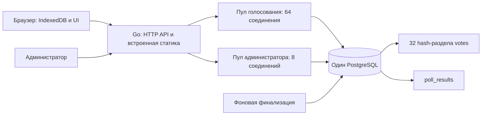
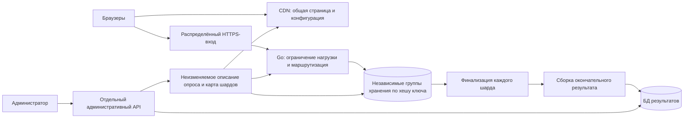

Архитектура Gigaquizz и количественная модель, 10 сентября 2026 года.

После измерений и замечания пользователя о масштабе подготовлен [пересмотр архитектуры: пакетный журнал и последующая дедупликация](architecture-revision.md). По запросу пользователя этот кандидат реализован и испытан в изолированных `internal/votelog` и `cmd/logbench`, с явно изменённым смыслом экспериментального подтверждения. [Результаты HTTP/direct-нагрузок и отказов](log-results.md), [методика воспроизведения](log-benchmark.md). Основной PostgreSQL API сохраняется. Масштабирование сотнями PostgreSQL-групп больше не является основной рекомендацией. Ниже сохранены общая модель нагрузки и расчёты прежней атомарной схемы; её таблицы групп — чувствительность к условному throughput, а не план развёртывания.

Основной сервис: Go принимает ограниченные по размеру ответы; запись голоса и проверка уникальности выполняются атомарно в PostgreSQL; результаты пересчитываются после закрытия. Отдельный прототип журнала сохраняет попытки транзакционными пакетами Kafka и формирует точный результат/manifest после CLOSED. Его интеграция с административной БД и распределённое назначение владельцев ещё не выполнены. Доставка общих страниц через CDN и физически распределённый массовый приём остаются проектными частями; количество production-узлов и устойчивая доступность при отказе ещё не установлены измерениями.

В этом документе требования пользователя, предложения по размещению, расчётные допущения и выполненные проверки обозначены отдельно. Числа серверов в таблицах — чувствительность к условной производительности, а не результаты бенчмарка. Арифметика воспроизводится из корня проекта командой `python3 scripts/capacity_model.py`. Исходные решения и прежняя модель объединённой страницы сохранены в [рабочих заметках](../architecture-notes.md); поведение API — в [контракте](api.md).

Пользователь задал один активный опрос, 100 млн фактических голосующих, равномерную минуту, A/B либо выбор одного/нескольких вариантов, базовую защиту от повторного захода, приоритет минимальных потерь и возможность заранее подготовить инфраструктуру. Конверсия уже учтена. Новый допуск заканчивается через 60 секунд; ранее допущенная операция может закончить запись позже. Хранение случайного ID браузерного состояния в рамках опроса разрешено без заданного верхнего срока. Реализовано правило окончательности первого принятого выбора и ограничение в 20 вариантов; свободного текста ответа нет.

Предложение для оценки отказов — один регион и три зоны доступности. География участников, обязательность пережить потерю зоны или региона, максимальная аудитория сверх среднего, бюджет, допустимая погрешность часов и событийные SLO пока не согласованы. Далее три зоны используются как явно условная модель, без обещания, что такая инфраструктура уже создана.

Основной PostgreSQL-сервис устроен следующим образом:



`internal/poll` содержит правила вопроса и нормализацию выбора; `internal/httpapi` — API, вход администратора и ограничения конкурентности; `internal/postgres` — атомарное голосование, миграцию и барьер закрытия; `internal/web` — браузерный клиент. `cmd/gigaquizz` управляет запуском и завершением. Это один Go-бинарник с pgx/v5, без Redis и внешнего брокера. Проверенное локальное окружение: Go 1.26.1 и PostgreSQL 16.3; в Compose предусмотрен PostgreSQL 18. Перед внешним выпуском нужны актуальные исправления выбранной основной версии.

В БД три прикладные сущности: `polls` хранит вопрос, варианты и расписание; `votes` — `(poll_id, token, choices, accepted_at)`; `poll_results` — окончательный общий итог и счётчики вариантов. Уникальный ключ голоса — `(poll_id, token)`, физические разделы текущей таблицы выбираются по `token`. Создание пересекающихся окон сериализовано только в административной операции. Общего обновляемого счётчика на каждом голосе нет.

Кабинет защищён паролем из конфигурации и случайной серверной сессией: HttpOnly/SameSite-cookie, Secure при HTTPS, проверка Origin для изменений. Сессии сейчас хранятся в памяти процесса, ограничены по числу и истекают через 8 часов; после перезапуска нужен новый вход. Для нескольких административных экземпляров потребуется согласованное хранение сессий либо внешний вход организаторов; это отдельная задача от анонимного голосования. Раздельные пулы уже ограничивают конкуренцию за соединения, но пока используют один физический PostgreSQL и не изолируют его CPU/диски. В целевой схеме административные запросы и чтение готовых итогов обслуживаются отдельными ресурсами.

32 раздела — части таблицы одной БД: у них общие CPU, память, WAL и сервер хранения. Увеличение этого числа не создаёт независимых PostgreSQL-серверов. Такое разделение полезно для организации данных, но не заменяет физическое шардирование. Механизм внутренних разделов описан в [PostgreSQL 16: partitioning](https://www.postgresql.org/docs/16/ddl-partitioning.html).

Историческая схема масштабирования атомарной записи приведена ниже для сопоставления с расчётами. Её распределённые компоненты не реализованы; актуальный кандидат и границы испытанного прототипа журнала описаны в [пересмотре](architecture-revision.md):



Внешний вход и CDN могут быть одной услугой. Хранилище уникальных голосов остаётся источником истины. Административная БД распространяет конфигурацию заранее и не участвует в каждом POST. Результаты читаются из отдельного небольшого набора агрегатов. Для редкого заранее объявленного события мощность, соединения и диски готовятся до старта. Масштабирование после начала минуты не включается в гарантию приёма.

Основная арифметика неизменна:

```text
N = 100 000 000 голосующих
T = 60 секунд
λ = N / T = 1 666 666,67 новых голосов/с
r = среднее число дополнительных POST на один первоначальный голос
Rpost = λ × (1 + r)
```

При `r = 0,3` это 130 млн HTTP-попыток, но максимум 100 млн новых уникальных записей в данной модели. Условие не утверждает, что каждый повторный запрос имеет ту же стоимость в БД, что новая запись. Конкурентные дубли и потерянные ответы требуют отдельного измерения. Повторы уже входят в `Rpost`: второй раз умножать на 1,3 нельзя.

Сейчас первое открытие страницы вызывает пять GET: HTML, CSS, `common.js`, `poll.js`, JSON вопроса. Далее нужен один POST. ID создаётся локально, отдельного HTTP за ним нет. Участники не опрашивают результаты по таймеру. Предположим для таблицы, что каждый участник открывает страницу один раз в течение той же минуты, а все пять общих GET могут кешироваться. Это модель будущего CDN: равномерность открытий не следует из равномерности голосования.

```text
Rget = 5λ
Redge = λ × (6 + r)
Rorigin = λ × (1 + r) + 5λ × (1 − h)
h = доля попаданий в кеш для каждого из пяти GET
```

| Дополнительные POST | POST, млн/с | Все HTTP на внешнем входе, млн/с | HTTP за событие, млн | Origin при h=99%, млн/с | Origin при h=99,9%, млн/с |
|---|---:|---:|---:|---:|---:|
| 0% | 1,667 | 10,000 | 600 | 1,750 | 1,675 |
| 10% | 1,833 | 10,167 | 610 | 1,917 | 1,842 |
| 30% | 2,167 | 10,500 | 630 | 2,250 | 2,175 |

Повторная загрузка страницы не включена в r. Если каждый участник в среднем дополнительно открывает страницу v раз и все пять запросов снова уходят в сеть, `Rget = 5λ(1+v)`. При v=0,1 добавятся 50 млн GET, или 0,833 млн GET/с; браузерный кеш может уменьшить эту прибавку. Favicon, отдельная синхронизация времени и любые будущие технические вызовы также считаются отдельно. Например, десять администраторов с обновлением раз в пять секунд создают только 2 RPS, но в целевой схеме каждый такой запрос читает готовый снимок, а не запускает полный scan голосов.

В текущем приложении CDN отсутствует, а HTML и API имеют `Cache-Control: no-store`. Если поставить перед ним кеш только для трёх статических файлов с h=99%, origin при 30% повторов получит `λ × (1,3 + 2 + 3×0,01) = 5,55 млн RPS`. Поэтому установка CDN без изменения контракта общих данных не даёт правый столбец таблицы автоматически.

JSON сейчас содержит `server_time`, по которому UI корректирует часы. Кешировать его на длительное время без изменения клиента нельзя: застарелое время сдвинет отображаемый отсчёт. Для масштабной версии нужны неизменяемые описание/дедлайн, версия в ключе кеша и корректный источник времени на внешнем входе либо обработка возраста ответа с измеримой погрешностью. Если выберем отдельный запрос времени на каждого участника, добавится 100 млн GET, то есть 1,667 млн GET/с; приведённая таблица этого дополнительного запроса не включает. Допуск всё равно решает сервер хранения.

Общий HTML не должен содержать персональный токен или `Set-Cookie`. Токен передаётся только в теле POST, ответы о конкретном голосе не кешируются. В ключ кеша общих объектов не включаются ID участника или случайные параметры. Версии файлов и опроса публикуются заранее; промахи и холодные точки CDN проверяются отдельно. Объединение двух JS-файлов убрало бы один GET: 100 млн запросов за событие. Это возможная оптимизация, не уже выполненное изменение.

Равномерная модель — согласованная база. Чувствительность к иным профилям нужна потому, что 100 млн названы вероятным средним, а не максимумом:

| Условный профиль, всего 100 млн | Новые голоса в первом интервале, млн/с | Новые голоса в оставшееся время, млн/с | POST первого интервала с 30% повторов, млн/с |
|---|---:|---:|---:|
| Равномерно 60 с | 1,667 | 1,667 | 2,167 |
| 50% за первые 10 с, остальные за 50 с | 5,000 | 1,000 | 6,500 |
| 80% за первые 10 с, остальные за 50 с | 8,000 | 0,400 | 10,400 |
| 10% за первую секунду, остальные за 59 с | 10,000 | 1,525 | 13,000 |

Эти всплески не объявлены обязательным пределом. Проектный конверт пока составляет 1,667 млн новых голосов/с и 2,167 млн POST/с, плюс общие GET. При увеличении числа голосующих вдвое соответствующая нагрузка и объёмы удваиваются. Для `m` одновременных одинаковых опросов они умножаются на `m`; сейчас `m=1`. Средняя доля повторов не ограничивает их синхронный пик.

Сетевую ёмкость определяет также размер страницы. Здесь B — байт, GB/TB — десятичные единицы, KiB — 1024 B; сетевые Gbit/s получаются умножением байтов/с на восемь.

Измерение файлов текущего публичного UI, а не перехват сетевого обмена:

| Файл | Исходный размер, B | gzip уровня 9, B |
|---|---:|---:|
| poll.html | 3 030 | 1 339 |
| app.css | 16 791 | 4 452 |
| common.js | 2 345 | 1 058 |
| poll.js | 13 923 | 4 394 |
| Всего | 36 089 | 11 243 |

При условном вопросе в 1 KiB сжатый набор тел составляет 12 267 B. Сжатие здесь выполнено для расчёта: встроенный HTTP-сервер сейчас сам не включает gzip. В качестве компактного целевого бюджета далее используем 16 KiB на все пять тел GET. Длинный вопрос и 20 длинных вариантов могут увеличить JSON; это бюджет, который нужно проверять, а не ограничение API в 1 KiB.

| Все тела GET на участника | Тела за событие | Исходящий поток при загрузке за 60 с | При загрузке за 10 с |
|---|---:|---:|---:|
| 16 KiB | 1,6384 TB | 218,45 Gbit/s | 1,311 Tbit/s |
| 50 KiB | 5,12 TB | 682,67 Gbit/s | 4,096 Tbit/s |
| 100 KiB | 10,24 TB | 1,365 Tbit/s | 8,192 Tbit/s |

Открытие всеми страницы за 10 секунд создаёт 50 млн GET/с даже при равномерной последующей отправке голосов. Предварительное открытие страницы переносит этот поток во времени, а предварительный прогрев CDN уменьшает промахи; эти два действия не взаимозаменяемы. Для 16 KiB и одинакового h=99,9% исходящие тела общих GET от origin составят 1,6384 GB за событие; при h=99% — 16,384 GB. Это не учитывает POST.

Тело POST — небольшой JSON, но сетевой запрос содержит заголовки, HTTP/TLS framing и транспорт. При переиспользовании соединений примем условные 0,7–2 KiB входящего обмена на POST и 0,3–1 KiB исходящего. Полезный payload включён; TLS handshake, GET-overhead и повторная передача пакетов считаются отдельно.

| 130 млн POST-попыток | За событие | Средний поток |
|---|---:|---:|
| Вход, 0,7–2 KiB | 93,184–266,24 GB | 12,42–35,50 Gbit/s |
| Выход, 0,3–1 KiB | 39,936–133,12 GB | 5,32–17,75 Gbit/s |
| Оба направления | 133,12–399,36 GB | 17,75–53,25 Gbit/s |

Лимит тела текущего vote API — 4096 B, поэтому тест только с коротким JSON недостаточен. При 130 млн тел ровно по 4096 B получаем 532,48 GB входящих данных, или 71 Gbit/s, ещё до заголовков. Валидные обычные выборы гораздо компактнее, но вход должен защищать БД от большого и неверного запроса до записи.

Каждый дополнительный 1 KiB обмена на GET добавляет `500 млн × 1024 = 512 GB` к событию. Предположение об одном новом TLS-соединении на участника даёт 1,667 млн handshakes/с; условные 4 KiB на handshake добавят 409,6 GB обмена. Это отдельные статьи, их нельзя выдавать за включённые в размеры HTML или записи БД. Фактические величины зависят от HTTP-версии, TLS resumption, заголовков и сертификатной цепочки.

Пример проверяемого внешнего ограничения: у CloudFront pay-as-you-go указаны исходные квоты 250 000 запросов/с и 150 Gbit/s на distribution. Наши 10,5 млн RPS в 42 раза больше первой квоты; даже компактные тела GET превышают вторую. Требуется заранее подтверждённое повышение ёмкости; ограничения других планов отличаются. Это не рекомендация создавать 42 домена. Источник, проверен 10.09.2026: [CloudFront quotas](https://docs.aws.amazon.com/AmazonCloudFront/latest/DeveloperGuide/cloudfront-limits.html).

Конкурентность считаем по закону Литтла `L = R × W`, где `W` — среднее время в конкретной границе системы. p99 вместо среднего использовать нельзя. При 2,167 млн POST/с:

| Среднее время POST в выбранной границе | Одновременно выполняющихся POST |
|---|---:|
| 20 мс | 43 333 |
| 100 мс | 216 667 |
| 300 мс | 650 000 |
| 1 с | 2 166 667 |

Время браузер → внешний вход → ответ включает пользовательскую сеть и не равно времени занятости Go-обработчика или SQL-соединения. Например, 650 тыс. внешних операций не означают 650 тыс. подключений к PostgreSQL. Открытые соединения считаются отдельно: одно новое соединение на участника со средней жизнью 30 секунд даёт примерно 50 млн открытых клиентских соединений в установившейся части события. Они завершаются на распределённом входе, который использует собственные пулы к origin.

В текущем Go-процессе максимум 256 одновременно допущенных vote-обработчиков, 16 публичных чтений БД и 8 административных операций. Пул голосования — 64 SQL-соединения. Чисто арифметический предел пула при среднем удержании соединения 5 мс: `64 / 0,005 = 12 800 операций/с`, без учёта остальных ограничений. Это верхняя оценка по одной ресурсоёмкости, не измеренная скорость приложения. При целевом POST-потоке и таком SQL-времени весь распределённый сервис потребовал бы не менее 10 834 одновременно занятых соединений. Увеличивать `max_connections` одного PostgreSQL до этого числа вместо распределения нагрузки не является планом масштабирования.

CPU оценивается через измеренные CPU-секунды на попытку: `ядра ≥ R × CPU_time / u`. Возьмём условную загрузку `u=0,65`:

| Условные CPU-затраты Go на попытку | Ядра для 2,167 млн POST/с при u=65% |
|---|---:|
| 0,05 мс | 167 |
| 0,2 мс | 667 |
| 1 мс | 3 334 |

Это чувствительность, не характеристика Go. CPU базы, TLS-входа и подсчёта сюда не включён. Сначала измеряются parse/validation, ожидания, SQL и GC на целевом железе; затем выбирается число экземпляров. Для памяти используется `M ≈ Lhandler × mhandler + Lconn × mconn + пулы + runtime + запас`. Например, условные 16 KiB на 43 333 одновременно занятых обработчика дают 0,71 GB распределённой памяти; столько же на 650 тыс. обработчиков — 10,65 GB. Данные БД и клиентские TLS-соединения находятся в других границах модели.

Для распределения одного опроса ключ маршрутизации должен зависеть от случайного токена. Предлагается `bucket = H(poll_id, token) mod B`, например `B=4096` логических корзин. На 100 млн ключей средняя корзина содержит 24 414 голосов, принимает 407 новых голосов/с и 529 POST/с с 30% повторов. Это средние величины; небольшие интервалы, неравномерность оборудования и намеренно выбранные токены могут давать перекос.

Корзина — единица маршрутизации, не отдельный сервер. Неизменяемый manifest опроса содержит список корзин, отображение на физические группы хранения, версию схемы, расписание и epoch. Manifest устанавливается на каждом владельце до события. Владелец проверяет, что ключ действительно принадлежит его корзинам и epoch: проверки только в router недостаточно. Карта не меняется во время минуты и обработки хвоста. Повтор и восстановление после сбоя идут к той же логической группе; перенаправление на произвольный свободный шард создаст второй источник истины.

Текущая PostgreSQL-функция может стать основой локальной операции такой группы, но физическое шардирование, manifest, проверка владения, отказоустойчивое переключение и распределённая финализация ещё нужны. Отдельный `poll_id` как единственный ключ распределения отправил бы весь опрос на один узел. Один общий `INCR` результата на POST также создал бы точку сериализации. Эти зависимости убраны из предлагаемого массового пути.

Число Go-экземпляров и число групп хранения считаются разными формулами. Пусть `qapp` — измеренная устойчивая производительность одного Go-экземпляра при нужных задержках; дополнительный запас задаём `u=0,65`. При трёх одинаковых зонах и необходимости перенести весь поток на две оставшиеся число экземпляров:

```text
napp = 3 × ceil(Rpost / (2 × u × qapp))
```

| Только условный qapp | Требуемые Go-экземпляры по формуле |
|---|---:|
| 10 000 POST/с | 501, по 167 в зоне |
| 20 000 POST/с | 252, по 84 в зоне |
| 50 000 POST/с | 102, по 34 в зоне |

Эта таблица показывает цену неизвестного `qapp`, а не рекомендует купить 252 сервера. Производительность учитывает реальный ответ хранилища, долю повторов, размер запроса, GC, p99 и ошибки; дополнительная нагрузка оставшихся origin GET должна обслуживаться отдельным запасом либо включаться в измерение.

Загрузка 65% в этой формуле относится к двум оставшимся зонам после отказа. До отказа она составляет примерно 43%, поскольку заложены и резерв зоны, и запас производительности. Если измеренное q уже содержит такой запас, повторно уменьшать его на u не нужно. Внутри `ceil` используется точная дробь N/T; округление Rpost вверх до целого до расчёта может ошибочно добавить целую группу хранения.

Для хранения пусть `qshard` — измеренная пропускная способность одной физической группы при смешанном потоке и нужной синхронной сохранности, включая режим отказа зоны. Возьмём ещё коэффициент перекоса `β=1,2`:

```text
S ≥ ceil(β × Rpost / (u × qshard))
```

| Только условный qshard | Группы S | Экземпляры БД при 3 копиях на группу |
|---|---:|---:|
| 10 000 попыток/с | 400 | 1 200 |
| 25 000 попыток/с | 160 | 480 |
| 50 000 попыток/с | 80 | 240 |

Три копии одной группы содержат одни и те же ключи. Их нельзя посчитать как три независимых write-shard и ещё раз применить к S коэффициент 3/2 из статического Go-пула. При отказе одна группа сохраняет свою часть ключей и меняет primary на подходящую реплику. Пропускную способность нужно измерять с этим размещением, задержкой репликации и переходом лидера. До измерений невозможно обосновать ни десятки, ни сотни PostgreSQL-групп; при высокой цене такого варианта сравниваем иное распределённое атомарное хранилище или журнал.

Базовая дедупликация работает без регистрации. Браузер получает 16 случайных байт через криптографический генератор и хранит запись `poll_id → token` в IndexedDB. Короткая readwrite-транзакция создаёт/читает ID и фиксирует первоначальный выбор до отправки запроса. Это согласует две вкладки одного origin; сама серверная уникальность остаётся обязательной. Основание браузерного механизма: [IndexedDB: планирование транзакций](https://www.w3.org/TR/IndexedDB/#transaction-scheduling), [Web Crypto: getRandomValues](https://www.w3.org/TR/webcrypto/#Crypto-method-getRandomValues), проверены 10.09.2026.

Вероятность хотя бы одной случайной коллизии 128-битного ID при 100 млн независимых генераций приблизительно `N(N−1)/(2×2^128) = 1,47×10^−23`. Практический предел защиты — повторная генерация через другой браузер, устройство или очистку данных. Общий профиль, наоборот, может объединить разных людей. Так измеряется уникальное браузерное состояние, а не доказанная уникальность человека. При недоступной IndexedDB текущий UI допускает голос с ID страницы и показывает ограничение.

IP для этого не нужен. Вход видит адрес сетевого соединения, но приложение не сохраняет IP, User-Agent и fingerprint, а API отвергает лишние поля тела. Разрешение хранить токен не распространяется на сквозное профилирование разных опросов. При внешнем размещении это правило должно охватывать CDN, прокси, трассы, SQL-логи, резервные копии и выгрузки. Доступ к административным записям и сессиям рассматривается отдельно.

Размер технического состояния можно оценить снизу: `100 млн × 16 B = 1,6 GB` только на токены в бинарном виде. Ключ `(poll_id, token)` без накладных расходов занимает 3,2 GB. Условная точная таблица с выбором и состоянием по 64 B на элемент занимает 6,4 GB, по 128 B — 12,8 GB на копию. Это не измерение реализации конкретного map/Redis/PostgreSQL. В основной схеме отдельной таблицы дедупликации нет: уникальная строка голоса решает обе задачи.

Фильтр Bloom не может окончательно отбрасывать «уже виденные» ключи: ложное совпадение потеряет новый голос. Для 100 млн ключей и проектного p=0,1% расчётный битовый массив занимает около 180 MB (`m=−n ln(p)/(ln 2)^2`), но ненулевая ошибка остаётся; при миллионе проверок новых ключей против заполненного фильтра ожидаются около тысячи ложных совпадений. Фильтр можно применять только как подсказку с точной проверкой; для уже имеющейся уникальной записи это дополнительная сложность без доказанного выигрыша.

На обычном пути выполняется один сетевой вызов SQL-функции: валидация и `INSERT ... ON CONFLICT DO NOTHING`. Если строки ещё нет, сохраняются ключ и выбор. Если есть, читается её окончательный выбор: одинаковый возвращает прежнюю квитанцию, другой — конфликт. Уникальность требует работы индекса, но не отдельного сетевого запроса к сервису дедупликации.

Один вызов функции не означает одну внутреннюю операцию БД. Текущий SQL читает описание опроса, проверяет JSON-варианты, получает advisory-lock, обслуживает уникальный индекс и foreign key. Общая строка опроса и менеджер блокировок могут создавать конкуренцию даже без обновляемого счётчика. Их влияние должно попасть в измерение q и профиль ожиданий перед переносом функции на массовое хранение.

Раздельные операции «поставить отметку в Redis → записать голос в PostgreSQL» оставляют после сбоя отметку без голоса. Обратный порядок допускает двойную запись при повторе. Наша атомарная строка не допускает этих промежуточных состояний. HTTP идемпотентен по стабильному ключу опроса; новый случайный ID на каждый повтор разрушил бы эту гарантию.

Инварианты основной схемы:

1. Для `(poll_id, token)` существует не больше одного принятого выбора.
2. Подтверждение нового голоса отправляется после commit с требуемой сохранностью; потеря HTTP-ответа не отменяет commit.
3. Новая операция допускается только в интервале `[starts_at, ends_at)`, где `ends_at = starts_at + 60 с`.
4. Итог включает все допущенные голоса, закоммиченные в авторитетном надёжном наборе данных, и публикуется только после завершения всех владельцев ключей. Локальные неподтверждённые записи потерявшего право записи primary не являются отдельным источником итогов.
5. Повторная доставка или повторный подсчёт не увеличивает итог второй раз.

Допуск и подтверждение — разные моменты. В текущей БД допуск ставится после ожидания admission-lock и проверки содержимого по `clock_timestamp()` PostgreSQL. Время получения первого байта на прокси и время нажатия кнопки не являются допуском. Запрос может прибыть на вход в 59,9 с, но дойти до этой точки в 60,1 с и быть отклонён; очередь до допуска не продлевает окно.

| События | Исход |
|---|---|
| Допуск 59,900; commit 60,200 | Голос учитывается, подтверждение возможно после закрытия |
| Новый запрос допущен только в 60,001 | Новая запись запрещена |
| Commit был, HTTP-ответ потерялся | Повтор с тем же ID и выбором возвращает квитанцию |
| После закрытия пришёл другой выбор того же ID | Старый выбор сохраняется, ответ — конфликт |
| После закрытия старый запрос ещё работает | Ожидание исхода либо `unknown`; отсутствие строки пока не доказывает отказ |
| Процесс/транзакция умер до commit | Подтверждения нет; запись может отсутствовать, поздний новый допуск запрещён |

До commit допущенный голос ещё не гарантированно сохранён. Если требуется пережить смерть процесса именно между допуском и commit, весь допущенный ответ должен попасть в отдельное надёжное состояние до исчезновения процесса. RAM-очередь этого не обеспечивает. Текущий срез такую дополнительную гарантию не заявляет.

Финализатор текущей БД после дедлайна получает эксклюзивные блокировки всех 64 полос допуска и ждёт ранее допущенные транзакции. Полосы блокировок и 32 раздела таблицы — разные механизмы. После барьера он считает результат и фиксирует его вместе с `finalized_at`. Позднее чтение квитанции также должно дождаться возможной прежней записи. В SQL-тестах отдельно проверены завершение commit после дедлайна, rollback и пересечение границы во время ожидания.

На распределённых шардах применяются локальные барьеры, затем каждый владелец публикует завершение своего набора корзин и версию результата. Глобальный финализатор ждёт весь список из manifest. Отсутствующий шард означает `processing`, а не нулевые голоса. После локального завершения старые writer epochs должны быть заблокированы; барьер не должен существовать только в памяти потерянного Go-процесса. При повторном запуске результаты шарда записываются заменой по `(poll_id, generation, shard_id)`.

Часы разных PostgreSQL-primary не являются одними физическими часами. Для размещения в нескольких группах нужен согласованный предел ошибки ε, мониторинг времени и правило остановки допуска при превышении. При условных ±5 мс суммарная зона неопределённости границы имеет ширину 10 мс, куда при равномерном потоке попадают около 16 667 голосующих. Это не прогноз потерь, а чувствительность семантики к ε. Закрытие должно быть необратимым даже при переводе часов назад. Абсолютное совпадение независимых физических часов в одну наносекунду не обещается.

Для хранения различаем компактный формат, фактическую таблицу и WAL. Например, возможный двоичный формат содержит 16 B poll_id, 16 B token, 4 B маску 20 вариантов и 8 B времени: 44 B, или около 64 B с версией/служебными полями. В текущем PostgreSQL используется `integer[]`, а не такая маска. У PostgreSQL есть заголовки строк и страниц, выравнивание и отдельные индексы; размер полезных полей не равен месту на диске. Источник структуры: [PostgreSQL 16: page layout](https://www.postgresql.org/docs/16/storage-page-layout.html).

| Величина | Формула | Пример для 100 млн |
|---|---|---:|
| Логические записи | N × b, b=64–256 B | 6,4–25,6 GB |
| Три копии логических записей | 3 × N × b | 19,2–76,8 GB |
| Таблицы и индексы, условный коэффициент a=4 при b=64 B | a × N × b | 25,6 GB на копию |
| WAL, условные w=512 B на новый голос | N × w | 51,2 GB на primary |
| Таблицы/индексы и сохранённый WAL на 3 копиях | 3 × (25,6+51,2) | 230,4 GB |

`a=4` и `w=512 B` — примеры расчёта, а не измеренные свойства PostgreSQL. Последняя строка предполагает сохранение WAL всего события на каждой копии; политика очистки меняет занимаемый объём. Свободное место, временные файлы, резервные копии и исторические опросы добавляются отдельно. При такой условной конфигурации двукратный запас диска дал бы 460,8 GB распределённо; минимальные размеры дисков отдельных узлов могут стоить больше фактически используемых байтов.

WAL особенно чувствителен к индексам, checkpoint/full-page images и конкурентным повторам. При оценке повторные попытки могут добавлять собственную работу и журнал; таблица ниже считает только N новых голосов. Она не включает протокол SQL, подтверждения реплик и передачу запросов от Go:

| Условный WAL на новый голос | WAL за событие на primary | Скорость WAL, MB/s | Передача двух дополнительных копий WAL, Gbit/s |
|---|---:|---:|---:|
| 256 B | 25,6 GB | 426,67 | 6,83 |
| 512 B | 51,2 GB | 853,33 | 13,65 |
| 1024 B | 102,4 GB | 1 706,67 | 27,31 |
| 4096 B | 409,6 GB | 6 826,67 | 109,23 |

Это суммарные потоки всех primary/реплик кластера. Измерять нужно прирост WAL, физические размеры таблиц и индексов, latency flush, IOPS и bandwidth при выбранном отказе. Один commit на голос не означает один отдельный физический fsync: PostgreSQL может объединять flush нескольких транзакций. Полностраничные записи увеличивают журнал после checkpoint. Источник этих механизмов: [PostgreSQL 16: WAL settings](https://www.postgresql.org/docs/16/runtime-config-wal.html).

Для трёхзонного варианта каждая группа может иметь primary и две реплики в разных зонах, ACK после локального durable WAL и durable WAL как минимум одной другой зоны. В PostgreSQL `synchronous_commit=on` ждёт реплику только при настроенном `synchronous_standby_names`; в локальном срезе синхронной реплики нет. Семантика подтверждения сверена с [документацией PostgreSQL 16](https://www.postgresql.org/docs/16/warm-standby.html#SYNCHRONOUS-REPLICATION).

Такая запись даёт основу для сохранения подтверждённых голосов при потере одной зоны, но только вместе с корректным failover: новый primary должен содержать все подтверждённые commit, старый должен потерять право записи, и число нужных подтверждающих реплик не должно молча уменьшаться до нуля. Произвольная асинхронная реплика не подходит. PostgreSQL сам не реализует весь внешний протокол обнаружения отказа и переключения; требуется выбранный HA-контроллер и испытания. Основание: [PostgreSQL 16: failover](https://www.postgresql.org/docs/16/warm-standby-failover.html).

Есть отдельный край восстановления: отмена ожидания синхронной репликации может оставить локально committed строку без требуемой удалённой копии. Последующий read-only запрос `duplicate` сам не доказывает её репликацию. Поэтому перед HA-запуском недостаточно включить только настройки реплик: все положительные квитанции, включая восстановленные, и финальные manifests должны иметь проверку требуемой сохранности. Возможное решение — подтверждённый WAL-барьер того же владельца/epoch/timeline, покрывающий найденный commit; без такого свидетельства возвращается `unknown`. Обработка отмены SyncRep и предупреждений входит и в путь нового ACK. В экспериментальном режиме физической репликации этот барьер уже реализован для новых и восстановленных квитанций, чтения опросов и результатов; подробности и границы — в [replication-durability.md](replication-durability.md). Локальный режим одной БД остаётся отдельной конфигурацией. Источник: [PostgreSQL 16: отмена SyncRep](https://github.com/postgres/postgres/blob/REL_16_STABLE/src/backend/replication/syncrep.c#L297-L310), проверен 10.09.2026. Обязательный тест: остановить подтверждение реплики → прервать ожидание → повторить запрос → потерять primary → сверить все выданные клиентам подтверждения.

Для приоритета минимальных потерь нужно разделить две цели: не потерять уже подтверждённые голоса и позволить всем новым участникам успеть в окно. Нулевая потеря подтверждённых записей при заданном отказе не означает нулевую недоступность.

| Условная доля голосующих, успешно обслуженных за событие | Необслуженных из 100 млн | Эквивалент полной недоступности при равномерном потоке |
|---|---:|---:|
| 99,9% | 100 000 | 60 мс |
| 99,99% | 10 000 | 6 мс |
| 99,999% | 1 000 | 0,6 мс |

Последний столбец — строгая арифметика без восстановления за счёт повторов, а не требуемое время каждого переключения. Он показывает, почему месячное SLA не описывает минутное событие. Пять секунд остановки всего приёма затрагивают `5λ = 8,33 млн` первичных попыток, а пятисекундный сбой группы с 1/S ключей — примерно `8,33 млн/S`, если распределение равномерно. Повторы до закрытия могут восстановить часть этих голосований; последние секунды не имеют такого запаса.

Другая ситуация — остановка обработчика при продолжающемся надёжном приёме. Тогда за пять секунд в durable-буфере накопится 8,33 млн уникальных записей, около 0,533 GB при 64 B на запись до протокола и реплик. Если приём остановился вместе с обработчиком, эти данные не существуют в очереди. После восстановления время разгрузки при продолжающемся потоке равно `Q/(μ−λ)`: 20 с при μ=1,25λ, 10 с при μ=1,5λ, 5 с при μ=2λ. После прекращения поступления новых записей используется `Q/μ`. Журнал попыток с 30% повторов накопит больше записей, чем эта уникальная модель.

| Сбой | Подтверждённые голоса | Новые попытки | Восстановление / проверка |
|---|---|---|---|
| Потеря HTTP-ответа после commit | Сохранены | Исход клиенту неизвестен | Тот же ID/выбор возвращает квитанцию |
| Падение Go-процесса | В БД остаются | Незакоммиченные операции могут пропасть | Новый процесс, повтор, сверка |
| Падение primary | Зависит от подтверждённых реплик и failover | Пауза до корректного владельца | Выбрать актуальную реплику, запретить старому запись |
| Потеря одной зоны в предлагаемом HA | Цель — ноль потерь подтверждённых при заявленной модели | Перераспределение Go, переход лидеров БД; возможны временные отказы | Испытать сохранность и успевшие голосования отдельно |
| Разделение сети / нет нужного подтверждения реплики | Не удаляются | Новые ACK приостанавливаются, возможен unknown | Восстановить право записи и репликацию |
| Замедление БД / заполнен ограниченный допуск | Не удаляются | Текущая попытка получает перегрузку либо unknown | Снизить повторы, устранить причину, повторить тем же ID |
| Падение подсчёта | Исходные записи остаются | Приём независим в целевой схеме | Повторить локальный подсчёт без удвоения |
| Нет результата одного шарда | Полнота пока не доказана | Закрытое окно этого опроса не продлевается | `processing` до восстановления шарда |
| Потеря региона или всех надёжных копий | Вне текущей гарантии | Возможна полная недоступность | Другая схема репликации, отдельные RPO/RTO |

В текущем Go ограничитель срабатывает до чтения vote-body; длинные запросы не должны превращаться в неограниченное ожидание БД. После полного чтения и проверки операция получает отдельный срок 10 секунд, переживающий отключение клиента. Она остаётся в HTTP-обработчике, поэтому graceful shutdown может ждать её завершения до 20 секунд. Пределы HTTP: чтение заголовка 5 с, запроса 8 с, записи ответа 15 с. У PostgreSQL statement timeout 30 с и lock timeout 5 с; более короткий контекст приложения действует раньше. Это текущие защитные настройки для разработки, не целевые p99 на массовом событии.

Перегрузка текущей попытки не доказывает отсутствие предыдущего commit. UI сохраняет pending-ID и выбор до сети. После ошибки доступен ручной повтор с возрастающей случайной задержкой 1–2, 2–4, 4–8 секунд и учётом `Retry-After`; автоматических POST нет. После закрытия можно восстановить исход ранее принятого голоса. Для массового режима нужны отдельные бюджеты admission и чтения квитанций, чтобы разрешение неизвестных исходов не мешало оставшимся новым голосам. Жёсткий лимит «один запрос на IP» не подходит базовой модели уникальности.

Подсчёт можно выполнять после барьера закрытия, поэтому на пути POST не нужны онлайн-агрегаторы. Один проход по уникальным записям каждого шарда считает число строк и по одному 64-битному счётчику на вариант. При средней кратности выбора k требуется `N×k` прибавлений: 300 млн при k=3, максимум 2 млрд при 20 выбранных вариантах. Объединение итогов S шардов и 20 вариантов — только `S×21` чисел; при S=160 это 26 880 B самих счётчиков, без manifest и служебных полей.

Для single choice сумма счётчиков равна числу уникальных голосов. Для multiple choice каждый счётчик не превосходит число голосов, а сумма лежит между Naccepted и 20×Naccepted; складывать её как число участников нельзя. Повторный подсчёт перезаписывает частичный результат своей версии. Публикация финальной версии атомарно переключает ссылку только после получения всех ожидаемых частей. После этого админка читает маленький готовый объект.

Нижняя оценка чтения `D/read_bandwidth` не является временем SQL-подсчёта. Условные 25,6 GB данных при суммарных 500 MB/s дадут 51,2 с только на чтение; CPU, распаковка массивов, блокировки и хвост допущенных операций добавят время. Текущая функция отдельно считает строки и варианты, а фоновый проход ограничен 15 секундами: этот способ нужно адаптировать до 100 млн, иначе большой scan будет прерываться. Длительный подсчёт допустим по требованию пользователя и не должен менять дедлайн приёма.

Для независимой сверки сохраняются исходные уникальные записи и manifest завершения. Сравниваются множество подтверждённых тестовых ключей, сохранённые записи и результат; совпадение одной общей суммы не доказывает отсутствие взаимно компенсировавшихся потерь и дублей. Проверки по каждому ключу выполняются в испытательной среде с ограниченным доступом; токены не становятся метками метрик или строками access-log. Удаление исходных записей после финала лишает нас возможности такого пересчёта, поэтому срок определяется окном восстановления и аудита, а не длиной голосования в 60 секунд.

Альтернатива атомарной записи — сначала сохранять все допущенные попытки в распределённый журнал, затем удалять повторы при обработке. Этот вариант полезно сравнить измерениями, поскольку результаты не нужны немедленно:

| Свойство | Атомарный уникальный голос | Журнал попыток и последующая дедупликация |
|---|---|---|
| Что означает первый ACK | Окончательный выбор сохранён | Кандидат сохранён; его окончательный исход может быть ещё неизвестен |
| Основная нагрузка | 100 млн уникальных записей + проверки повторов | 100–130 млн событий в модели + точное состояние обработчика |
| Повтор после тайм-аута | Чтение прежнего уникального результата | Индекс квитанций или ожидание обработки |
| Конкурентные разные выборы | Победитель уникальной записи | Первый по устойчивому порядку одного раздела |
| Сбой подсчёта | Пересчёт уникальных строк | Replay и восстановление дедупликации/checkpoint |
| Сложность закрытия | Барьер каждой группы и manifest | Завершение всех writers и terminal offsets всех разделов |
| Потенциальный выигрыш | Меньше состояний и хранимых повторов | Последовательная пакетная запись и независимая обработка |

В журнале все попытки одного `(poll_id, token)` должны попадать в один устойчивый раздел; число разделов/маршрут нельзя менять посреди события. Брокерная идемпотентность producer не определяет уникальность браузера. Для Kafka примером конфигурации служат replication factor=3, `acks=all`, `min.insync.replicas=2`, idempotent producer и запрет выбора устаревшего лидера. Эти настройки относятся к репликации и повторной доставке; `acks=all` не означает fsync каждой записи на каждом диске. Граница сохранности требует отдельного отказного теста. Источники для рассмотренной версии 4.1: [producer](https://kafka.apache.org/41/configuration/producer-configs/), [topic](https://kafka.apache.org/41/configuration/topic-configs/), [модель репликации](https://kafka.apache.org/41/design/design/).

Marker CLOSED, отправленный одним producer ровно в 60 секунд, недостаточен: другой producer ещё может дописать допущенный в 59,9 с ответ. Нужны завершение всех разрешённых writer epochs, запрет их последующей записи и фиксация конечных позиций разделов. Только после чтения до этих позиций можно публиковать финал. Восстановление обработчика не должно увеличивать счётчик повторно: состояние обработанных ключей и позиция согласуются атомарно либо результат полностью пересобирается в новую версию.

В основном сервисе остаётся атомарный вариант с окончательной квитанцией. [Пакетный журнал](architecture-revision.md) реализован отдельным прототипом, поскольку поздний подсчёт разрешён, а прежние измерения не обосновывают масштабирование индивидуальной SQL-записи до требуемого потока. [Локальные результаты](log-results.md) показывают поведение при более высоком заданном потоке, включая неудачные повторы и отказы; direct-профили исключают HTTP и сравниваются отдельно. Устойчивая мощность, стоимость и необходимое число независимых серверов пока не определены. Пакетный PostgreSQL сохраняется как сравнительный вариант с прежним ACK, распределённое атомарное KV — как альтернатива.

Стоимость события определяется формулой, а не минутой работы одного сервера:

```text
Cevent = Cprepare
       + Σ(instances_i × billed_hours_i × price_i)
       + Crequests + Cnetwork_each_link
       + Cdisks_and_retention + Cfinalization
       + Ctelemetry + Coperations
```

До выбора географии и измеренного q полная денежная оценка имеет слишком большой диапазон. Например, только вычисления из условных строк `napp=252`, `S=160`, три БД на группу при четырёх часах подготовки/события/проверок стоят `1008×Papp + 1920×Pdb` USD, если P — реальные часовые цены соответствующих узлов. Это не включает диски, сеть и инфраструктуру управления. Четыре часа и обе численности — примеры чувствительности, не план аренды. Постоянное содержание добавляет часы между событиями; хранение исходных данных нельзя выключить вместе с временными Go-экземплярами.

Для внешнего трафика можно показать предметные составляющие на публичных ценах CloudFront pay-as-you-go, проверенных 10.09.2026. В США указано $0,0100 за 10 тыс. HTTPS-запросов, в Европе $0,0120; для следующего после бесплатного объёма диапазона передачи в этих географиях — $0,085/GB. Источник: [CloudFront pricing](https://aws.amazon.com/cloudfront/pricing/pay-as-you-go/). Применимость AWS к аудитории не установлена, это иллюстрация тарификации.

| Составляющая при 30% повторов | Иллюстрация USD |
|---|---:|
| 630 млн HTTPS, тариф США | 630 |
| Те же запросы, тариф Европы | 756 |
| Тела GET 16 KiB × 100 млн, приближение $0,085 за десятичный GB | 139 |
| Тела GET 50 KiB × 100 млн, то же приближение | 435 |

Получается примерно $770–895 только за перечисленные запросы и компактные тела GET, либо $1065–1191 для 50 KiB. Это не стоимость всего сервиса. Иллюстрация не вычитает месячные бесплатные квоты, не учитывает скидки/налоги и использует десятичное приближение GB; фактический биллинг зависит от единиц и накопленного месячного объёма. Ответы POST, передача запросов от CDN к origin, origin, балансировщики, TLS/заголовки по правилам биллинга, межзонная репликация, хранение и генераторы идут отдельно. Внутреннюю репликацию управляемой услуги нельзя повторно начислять, если она уже включена в её цену.

Телеметрию также нужно ограничивать количественно. Один лог в 300 B на каждый из 130 млн POST — 39 GB необработанных логов за минуту; на все 630 млн HTTP — 189 GB. Индексы, доставка и реплики увеличат стоимость. Нужны низкокардинальные счётчики и гистограммы по операции, коду исхода, группе/зоне и агрегированная диагностика сбоев. ID, IP, Cookie и тело запроса не используются как метки или стандартный содержательный лог. Серверный счётчик отправленных ответов отличается от числа подтверждений, действительно полученных клиентами.

Рабочее предложение по измеримым целям, требующее выбора географии и отказов: ноль потерь клиентом подтверждённых голосов после выбранного отказа; ноль двойного учёта; p95/p99 для успешной записи отдельно от быстрых отказов; доля обслуженных логических голосований за событие; число неизвестных исходов после периода сверки; время окончательного результата. Например, p99 в 1 секунду можно использовать как первоначальный критерий стенда, но пока это не требование пользователя и не подтверждённый SLO целевого масштаба. Подтверждение последнего допущенного голоса разрешено после 60-й секунды, поэтому окно наблюдения должно включать хвост обработки.

Порядок перехода к массовому запуску:

1. Измерить текущую атомарную операцию на выбранном серверном железе: обычные и конкурентные повторы, задержку SQL, WAL, FK/блокировки, checkpoint и стоимость durable ACK. Отдельно сравнить условную и безусловную запись с одинаковой сохранностью. Локальный подготовительный этап уже выполнен: [реплицированные подтверждения, измерения и отказные проверки](replication-results.md). Он проверяет методику и корректность, но ещё не даёт устойчивое серверное `q` или выделенную стоимость дедупликации.
2. Разделить общую кешируемую конфигурацию и часы; подготовить CDN, сжатие, ключи кеша и тест холодного открытия. Убрать чтение административной конфигурации из массового пути через заранее установленный manifest.
3. Выбрать физическое хранилище по измеренным q/стоимости; реализовать владение корзинами, стабильный маршрут, репликацию и корректное переключение, доказательство сохранности новых/восстановленных квитанций, локальный барьер и глобальную финализацию.
4. На небольших ступенях проверить весь путь и генераторы, затем 100 млн логических голосований ровно за минуту с 0/10/30% дополнительных попыток. Включить две вкладки, разные выборы с одним ID, потерю ACK и завершение на границе.
5. Повторить согласованный профиль при отказе процесса, primary и зоны; отдельно проверить сохранность и долю успевших участников. Не делать вывод о зоне из теста перезапуска одного Go-процесса.
6. Сверить клиентские подтверждения с источником истины и финальными результатами, проверить восстановление копии и повторный подсчёт. Зафиксировать квоты, аренду, версии, предел нагрузки, действия дежурных и бюджет следующего события.

Стоимость полного испытания — сумма стоимости каждого прогона, генераторов и их исходящего трафика, подготовки и анализа. POST-only тест не включает 500 млн GET и терабайты раздачи страницы; он полезен для приёма, но не подтверждает готовность полного пользовательского пути. Нагрузку нельзя считать подтверждённой, если генератор пропускает запланированные отправки или сам ограничивает скорость ожиданием ответов. Для дорогого полного прогона отдельно готовится конкретный план и бюджет.

Уже проверено для PostgreSQL-среза: тесты Go с race detector, интеграционные гонки, браузерная потеря подтверждения и повтор через закрытие. Локальные 1000 новых голосов и 200 повторов дали ровно 1000 окончательных голосов, сохранившихся после перезапуска приложения. Это проверка корректности, а не измерение предельного RPS. Отдельно выполнены тесты корректности журнала, минутные нагрузки и отказы брокеров; их результаты с ограничениями — в [log-results.md](log-results.md), команды — в [log-benchmark.md](log-benchmark.md). Общие свидетельства — [verification.md](verification.md), план испытаний основного API — [load-testing.md](load-testing.md).
