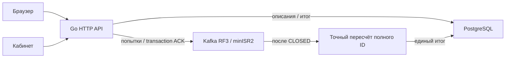

# PostgreSQL + Kafka: запуск и восстановление

`cmd/gigaquizz` подключает `internal/kafkapoll.Store` к настоящим HTTP-маршрутам и сайту. Прежний `internal/postgres.Store` сохранён для тестов и сравнений и не записывает голоса рабочего сайта этой ветки.



## Настройка

Создайте `.env.postgres-kafka` с правами `0600`, используя `.env.example`. `make dev` создаёт его автоматически, если файла ещё нет; существующие файлы окружения не переписываются. `make dev` и `make run` выбирают этот файл, либо путь из `GIGAQUIZZ_ENV_FILE`. Обязательны `DATABASE_URL` и случайный `ADMIN_PASSWORD` длиной от 16 символов. Окружение процесса имеет приоритет; файл не исполняется как shell-код.

```dotenv
HTTP_ADDR=127.0.0.1:8092
PUBLIC_URL=http://127.0.0.1:8092
GIGAQUIZZ_SCHEMA=gigaquizz_kafka_site
KAFKA_BROKERS=127.0.0.1:19092,127.0.0.1:19093,127.0.0.1:19094
KAFKA_PARTITIONS=4
MAX_INFLIGHT=1024
KAFKA_BATCH_VOTES=256
KAFKA_QUEUE_VOTES=2048
KAFKA_LINGER_MS=2
POLL_PREPARATION_SECONDS=20
MAX_UNIQUE_VOTERS=120000000
MAX_PARTITION_UNIQUE_VOTERS=120000000
MAX_STORED_POLLS=10000
```

```sh
go build -o bin/gigaquizz ./cmd/gigaquizz
./bin/gigaquizz -env .env.postgres-kafka
```

Контроллер создаёт собственную схему. `-migrate-only` создаёт таблицы метаданных и промежуточных результатов, не захватывая писателей Kafka. Схема содержит описание, расписание/конфигурацию журнала, признак завершённой подготовки, итог и время публикации. Voter ID, IP и User-Agent в таблицу не записываются. Kafka содержит случайный ID, выбор и время допуска; это технические данные для дедупликации.

По умолчанию Kafka ограничена числовыми loopback-адресами. `KAFKA_ALLOW_REMOTE_BROKERS=true` позволяет DNS/IP брокеров доверенной сети. Эта настройка только разрешает маршрутизацию к удалённым брокерам. TLS включается отдельно через `KAFKA_TLS=true`; доступны CA, клиентский сертификат и ключ, а также SASL PLAIN/SCRAM-SHA-256/SCRAM-SHA-512 поверх TLS. Имена переменных приведены в [.env.example](../.env.example) и [launch.md](launch.md). Приложение и независимый reader используют общий конструктор клиента; секреты не входят в сохранённую конфигурацию опроса. Локальные прогоны выполнены без TLS/SASL, проверка настоящего защищённого брокера остаётся отдельной задачей. Для внешнего HTTPS сайта нужен настроенный reverse proxy.

## Жизненный цикл

1. Создание сохраняет описание в PostgreSQL. Без даты сервер добавляет 20 секунд подготовки; будущий старт должен быть не ближе того же запаса. Перекрытие интервалов запрещено.
2. Контроллер создаёт уникальную тему RF3/minISR2, без compaction. Писатель становится доступен Vote только после завершения подготовки и durable записи `prepared` в PostgreSQL. При отменённом HTTP-создании описание может остаться в списке.
3. `Vote` читает память, проверяет варианты и ставит попытку в ограниченную Kafka-очередь. `202 recorded` возвращается после transaction commit с `acks=all`. Writer объединяет соседние одиночные попытки в compact frames, сохраняя время допуска каждой. Это попытка, а не обещание нового канонического голоса. Неизвестный исход повторяют с прежним ID.
4. Сервер проверяет время до enqueue. Допущенное в 59,9 секунды может закончить запись после дедлайна. Новые попытки после минуты получают `closed`, включая прежние ID.
5. `Seal` дренирует допущенное и записывает CLOSED в каждой партиции. `Replay` читает committed записи и проверяет конфигурацию и целый префикс. Полный ID всегда попадает в одну партицию; первый `(offset,index)` задаёт окончательный выбор.
6. Партиции считаются последовательно: точная `map[[16]byte]struct{}` хранит ID только текущего раздела. `MAX_PARTITION_UNIQUE_VOTERS` ограничивает эту таблицу, `MAX_UNIQUE_VOTERS` — общий итог. При превышении лимита результат остаётся pending с ошибкой. После каждого раздела сохраняется проверяемый checkpoint; после всех CLOSED общий итог и `finalized_at` сохраняются одной SQL-командой. Повторная финализация использует сохранённые checkpoints и проверенный финал.

Числовые нули в pending API не являются предварительным результатом: кабинет показывает ожидание. Сохранённый итог читается из PostgreSQL без Kafka.

## Владение и восстановление

Выделенная PostgreSQL-сессия держит advisory lock всё время работы контроллера. Heartbeat проверяет сессию и исходный запуск PostgreSQL. Потеря владения закрывает допуск, отменяет административные операции и закрывает писателей; автоматического повторного захвата нет. Shutdown закрывает Kafka-писателей до освобождения PG-сессии.

Новый запуск восстанавливает подготовленные опросы с прежними topic/config. `votelog.New` получает новые epochs прежних transactional IDs, ограждает старых producers, проверяет committed префикс и обнаруживает CLOSED. Новая минута не начинается. После дедлайна контроллер завершает CLOSED/пересчёт; готовый финал открывается из PostgreSQL.

До durable `prepared` писатель не публикуется в Vote. Если первоначальная подготовка осталась незавершённой, контроллер может выделить новую уникальную тему; старая сохраняется для диагностики и не могла содержать подтверждённых приложением голосов. Уже prepared тема никогда не заменяется и не создаётся заново при исчезновении.

Это не автоматическое HA PostgreSQL. Переключение primary требует внешнего fencing прежнего primary, единственного выбранного приложения и перезапуска. `DURABILITY_REQUIRED_STANDBYS`/`DURABILITY_STANDBY_NAMES` сохраняют проверки явного ANY-кворума метаданных, но не выполняют promotion. Независимые primary с отдельными advisory locks не входят в гарантию.

Kafka transaction ACK означает репликацию в текущем ISR при minISR2, а не отдельный fsync каждого брокера. Три процесса ноутбука не являются тремя зонами. Границы описаны в [Kafka replication](https://kafka.apache.org/43/design/replication/) и [implementation](https://kafka.apache.org/43/design/implementation/).

## Ограничения и проверки

- Очереди ограничены HTTP `MAX_INFLIGHT` и размером на партицию. Дефинитивный busy не является ACK; ошибка записи не превращается в успех.
- Инвентарь ограничен `MAX_STORED_POLLS`, одновременно незавершённых опросов не более 32 (граница числа подготовленных producers/очередей), общий exact-итог — `MAX_UNIQUE_VOTERS` (до 120 млн), map одного раздела — `MAX_PARTITION_UNIQUE_VOTERS`. Реальный map требует отдельного расчёта RAM; лимит не означает измеренной HTTP-производительности.
- Для позднего восстановления и будущих стартов retention темы отключена по времени/объёму. Приложение ничего автоматически не удаляет. Оператор контролирует диск и архивирование; потеря префикса не превращается в «готовый» неполный итог.
- Во время минуты неудачный writer остаётся остановленным. После закрытия приёма финализатор сначала дренирует здоровые партиции, закрывает старых producers и проверяет владение PostgreSQL. Затем он восстанавливает те же topic/config с fencing и завершает CLOSED. За один вызов maintenance выполняется не более одной попытки замены; ошибка оставляет итог pending до следующего вызова. Unknown-попытки не пересылаются, исходная минута не меняется. Это восстановление финализации, а не автоматическое переключение всего сервиса во время голосования.
- Потеря PG владения прекращает новые голоса, даже когда Kafka доступна.

```sh
go test -race ./...
go vet ./...
GIGAQUIZZ_APP_KAFKA_TEST=1 TEST_DATABASE_URL='ваше подключение' \
  go test -race -count=1 -v ./internal/kafkapoll
```

Интеграция сохраняет собственные `gq_app_test_*` схемы и `gqlog_app_*` темы. Тест длится настоящую минуту и не меняет часы. Останавливается только принадлежащая тесту PG-сессия; общие PostgreSQL, Kafka и сайт не останавливаются.

Полный расчёт нагрузки и изменений для 100 млн участников: [http-capacity.md](http-capacity.md). Ступенчатое сравнение настоящего HTTP-пути и пакетной записи: [http-results.md](http-results.md), [повторение измерений](http-benchmark.md).
