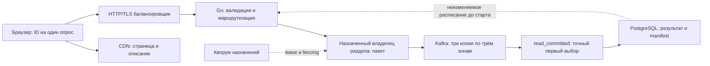

Production: топология, расчёт серверов и условия готовности

Дата модели: 10.09.2026. Площадка и бюджет пока не заданы. Ниже — предварительная конфигурация для одного региона и трёх зон, с сохранением мощности после потери одной зоны. Это допущение для планирования; отказ региона требует другого проекта. Число машин определяется производительностью полного пути приёма с репликацией. Локальные 1,8 млн/с RAM-ядра не являются производительностью HTTP-узла или Kafka.

В [новом реальном испытании Kafka](frame-results.md) compact-frame путь сохранил все 12 млн попыток при 200 тыс./с. При плане 1,7 млн/с сохранены 70,25 млн из 102 млн; восемь последовательных writers насыщены. После закрытия опросов выполнен принудительный перезапуск брокеров без перезапуска ОС; все подтверждения найдены. Это direct-измерение на одном компьютере; ниже оно не подставляется как производительность production HTTP-узла.

Для предварительной сметы предлагается **39 виртуальных/физических узлов плюс CDN и управляемый балансировщик**, из них 24 узла — основной путь Go/Kafka. Это один Kafka-кластер. 128 логических разделов не означают 128 машин или кластеров. Конфигурация условна: основное допущение — один Go-узел выбранного типа выдержит 250 тыс. попыток/с при согласованной задержке. Это ещё нужно измерить до заказа полного парка.

| Роль | Количество | На одну зону | Начальная аппаратная конфигурация | Зачем |
|---|---:|---:|---|---|
| Go: входящие запросы, маршрутизация и владельцы пакетов | 18 | 6 | 32 выделенных vCPU, 64 GiB RAM, 10 Gbit/s; системный SSD 100 GB | Приём и подготовка пакетов; данные RAM не считаются сохранёнными |
| Kafka brokers | 6 | 2 | 32 vCPU, 128 GiB RAM, локальный NVMe 1,92 TB, 10 Gbit/s | Реплицируемый журнал RF3; диск и сеть должны давать устойчивую, не кратковременную скорость |
| KRaft controllers | 3 | 1 | 4 vCPU, 8 GiB RAM, SSD 100 GB | Отдельный кворум управления Kafka |
| PostgreSQL административной части | 3 | 1 | 8 vCPU, 32 GiB RAM, SSD/NVMe 200 GB | Primary и две standby: опросы, версии конфигурации, результаты и manifest |
| Административный API и обработчики результатов | 3 | 1 | 8 vCPU, 32 GiB RAM, SSD 100 GB | Подготовка событий, точный пересчёт после закрытия, публикация результата |
| Координация владения разделами | 3 | 1 | 2–4 vCPU, 8 GiB RAM, SSD 100 GB | Кворум назначений/leases и fencing; KRaft не выдаёт приложению такие назначения |
| Метрики и эксплуатационные логи | 3 | 1 | 4 vCPU, 16 GiB RAM, SSD 250 GB | Наблюдаемость без записи каждого запроса и без token/IP в метках |
| CDN, защита периметра и балансировщик | Управляемые сервисы | Зональная отказоустойчивость провайдера | Нужны согласованные квоты RPS, TLS, трафика и соединений | Статика и публичный HTTP/TLS-вход; в число 39 не включены |

Размеры RAM и NVMe — стартовые конфигурации для стенда и сметы, а не доказанный минимум. NVMe 1,92 TB выбран как возможный серверный диск с запасом для retention и восстановления; одному опросу терабайт не нужен. Диск меньшего объёма пригоден, если хватает ёмкости по формуле ниже, ресурса записи и измеренной скорости. Высокая RAM Kafka нужна в основном ОС/cache, не огромной JVM-куче; размер heap следует подобрать измерением, начальный кандидат 8–12 GiB. Шифрование диска и защита накопителя при потере питания относятся к выбранному классу хранилища, но не превращают стандартный Kafka ACK в per-record fsync.

При управляемых Kafka/PostgreSQL/координации часть строк заменяется услугами провайдера: число самостоятельно обслуживаемых VM уменьшается, стоимость и соответствующие ресурсы остаются. Если используется управляемый Kubernetes, стоимость его control plane также надо учесть; его наличие само по себе не реализует протокол владения writers. Отдельный Redis для точной дедупликации в предлагаемом пути не нужен.

Поток данных



Go ingress и владельцы пакетов размещаются на тех же 18 узлах, с ограниченными очередями и распределённым назначением роли. Один token всегда идёт в один фиксированный раздел; передача владельцу может потребовать внутреннего сетевого перехода. Новая запись подтверждается после commit пакета Kafka. Ответ подтверждает сохранённую попытку; канонический первый выбор устанавливает пересчёт по порядку `(partition, offset, index)`. RAM-дедупликацию нельзя поставить перед надёжной записью и немедленно отвечать успехом: после падения возникнет потеря уже подтверждённого голоса.

Начальный кандидат — 128 разделов на один опрос; также стоит сравнить 64. Изменять число разделов во время события нельзя. При 2 млн попыток/с и 128 разделах средний поток на раздел — 15 625/с. За 20ms накопится около 312 попыток, а не максимальные 4096. Если каждый раздел фиксирует транзакцию каждые 20ms, получится около 6400 транзакций/с суммарно. Предел transaction coordinator и CPU брокеров нужно измерить отдельно: расчёт MB/s не доказывает эту производительность. Локальный новый тест использует меньше разделов и более крупные пакеты; его результат нельзя автоматически переносить на 128 разделов.

Расчёт Go-узлов

Исходные 100 млн фактических голосующих не уменьшаются:

`R_unique = 100 000 000 / 60 = 1 666 667 уникальных/с`.

С условными 20% повторных попыток `R = 2 000 000 попыток/с`. Цель использования доступной мощности — не более 70% как обычно, так и после потери зоны. Для трёх одинаковых зон и измеренной производительности одного Go-узла `r`:

`N = 3 × ceil(R / (2 × 0,7 × r))`.

| Полный путь одного Go-узла, пока гипотеза | Всего Go-узлов | Остаётся после отказа зоны | Загрузка оставшихся |
|---:|---:|---:|---:|
| 100 000 попыток/с | 45 | 30 | 66,7% |
| 200 000 попыток/с | 24 | 16 | 62,5% |
| 250 000 попыток/с | 18 | 12 | 66,7% |
| 300 000 попыток/с | 15 | 10 | 66,7% |

Остальные строки сметы дают ещё 21 узел, поэтому диапазон в этой sensitivity-таблице — 36–66 узлов плюс внешние сервисы. Это не диапазон измерений. В кандидате 18 Go-узлов обычная загрузка составляет `2M/(18×250k)=44,4%`, после потери шести — `2M/(12×250k)=66,7%`. vCPU разных платформ не равны друг другу; CPU с совместным использованием и burst-кредитами для такого расчёта не подходят без испытаний стабильной мощности.

70% — резерв устойчивой мощности, не обещание нулевой потери во время переключения. Например, недоступность трети потока на три секунды создаёт до `2M × 3 / 3 = 2 млн` первоначально неуспешных попыток. Повтор может успеть до дедлайна, а может не успеть. Поэтому отдельно нужны время обнаружения отказа, передачи владения, восстановления writer и бюджет повторов; особенно для отказа в последние секунды опроса.

Журнал, диски и сеть

Новый фактический формат — `80 B общего заголовка + 28 B × число попыток в frame`; 28 B состоят из полного 128-битного token, 32-битного выбора и 64-битного серверного времени допуска. В расчёте используется условное среднее 512 попыток/frame и дополнительный консервативный бюджет 12 B/попытку на Kafka record/batch/transaction overhead:

`B = 28 + 80/512 + 12 = 40,15625 B/попытку`.

12 B и средний frame 512 — отдельные допущения дисковой модели; 512 не выводится из приведённого сценария 128 разделов / 20ms, где ожидается около 312 элементов; actual payload и физический рост диска измеряются отдельно. Сжатие заранее не учитывается. При 120 млн попыток:

| Величина | Формула | Значение |
|---|---|---:|
| Логический вход в Kafka | 2M × B | 80,3125 MB/s |
| Суммарная запись трёх копий | 80,3125 × 3 | 240,9375 MB/s |
| Дополнительная репликация между брокерами | 80,3125 × 2 | 160,625 MB/s |
| Журнал одного опроса, одна копия | 120M × B | 4,81875 GB |
| Три копии без дополнительного запаса хранения | 4,81875 × 3 | 14,45625 GB |
| Хранение с условным запасом на служебные данные ×1,5 | 14,45625 × 1,5 | 21,684375 GB/опрос |

Здесь MB/GB десятичные. Три копии уже посчитаны: ещё раз умножать эти суммы на RF3 нельзя. Если сохранять семь событий, модель даёт около 151,8 GB на весь кластер, а не на каждый брокер. При шести одинаковых брокерах — около 25,3 GB на брокер при равномерном размещении. Для редких событий предварительное допущение retention — семь суток журнала; число событий за этот срок является входом модели. Архив и срок хранения для повторного аудита задаются отдельно, до включения автоматического удаления исходного журнала.

Для шести брокеров в обычном режиме средняя запись реплик — 40,156 MB/s на брокер. После потери одной зоны остаётся четыре брокера и две копии каждого раздела: `2×80,3125/4 = 40,156 MB/s` на оставшийся брокер. Лидерский вход вырастает с 13,385 до 20,078 MB/s. Поэтому нельзя механически умножать любую метрику на 1,5: число копий временно тоже меняется.

Сетевой бюджет модели добавляет явные 15% к передаче данных. После отказа зоны это около 46,18 MB/s входа на брокер, без восстановления третьей копии и чтения результатов. В модели для проверки используются условные пределы одного брокера: 200 MB/s лидерского входа, 600 MB/s записи реплик, 10 Gbit/s в каждом направлении. По этим допущениям арифметически достаточно трёх брокеров; шесть — отдельный эксплуатационный минимум кандидата, по два в зоне. Эти значения не измерены на production-железе и не учитывают лимит транзакций. Для возврата третьей копии нужен дополнительный поток `восстанавливаемые байты / время восстановления`; его следует ограничивать, чтобы он не отбирал мощность приёма. Пересчёт после минуты также читает весь журнал.

Внешний трафик может оказаться дороже журнала. При условных 1 KiB запроса и 0,5 KiB ответа 2 млн попыток/с означают 16,384 Gbit/s входящих запросов и 8,192 Gbit/s ответов, до дополнительных расходов TLS/транспорта. Балансировщик передаёт данные и клиентам, и Go, поэтому нужны квоты на обе стороны. Если 100 млн браузеров одновременно за минуту загружают страницу размером 50 KiB, это 5,12 TB раздачи CDN и примерно 683 Gbit/s: это отдельный условный сценарий страницы, не следствие равномерных голосов. Описание и статику нужно кешировать и прогреть заранее, без персональных cookies в публичном ответе. Количество TLS handshakes также проверяется отдельно: один POST от каждого нового браузера не даёт права предположить длинное соединение на сотни голосов.

При среднем времени ACK 50ms одновременно ожидаются `2M×0,05 = 100 000` попыток, при 200ms — 400 000. Это среднее время по закону Литтла, а не p99. Очереди, открытые соединения, NAT/порты генераторов и лимиты балансировщика входят в испытания. Сам по себе 10-Gbit/s интерфейс Go-узла не подтверждает его RPS.

Настройки сохранности и отказов

Kafka: RF3, по одной копии раздела в каждой зоне через `broker.rack`; `acks=all`, `min.insync.replicas=2`, producer idempotence и транзакции, `read_committed`, запрет unclean leader election. При трёх текущих ISR `acks=all` ждёт все три; minISR2 не означает «любые две самые быстрые». Для сопоставимости с прототипом ELR фиксируется feature level 0 и проверяется явно; это не строка обычного `server.properties`. Для внутренних журналов транзакций и offsets также проверяются RF3, ISR и зональное размещение. [Rack awareness](https://kafka.apache.org/43/operations/basic-kafka-operations/#balancing-replicas-across-racks), [настройки брокера](https://kafka.apache.org/43/configuration/broker-configs/), [ELR](https://kafka.apache.org/43/operations/eligible-leader-replicas/).

Три отдельные KRaft controller выдерживают отказ одного; две оставшиеся зоны сохраняют большинство. Совмещённые broker/controller роли Apache не рекомендует для критичных развёртываний. [Документация KRaft 4.3](https://kafka.apache.org/43/operations/kraft/).

Стандартный ACK Kafka опирается на репликацию и page cache, не доказывает индивидуальный fsync на всех копиях. Заявленная модель покрывает согласованные независимые отказы при сохранении работоспособных копий; одновременное обесточивание всего региона этой гарантией не покрывается. Если требуется физический flush каждой копии до каждого ACK, конфигурация и сравнение производительности должны быть пересмотрены. [Kafka: flush](https://kafka.apache.org/43/operations/hardware-and-os/#application-vs-os-flush-management).

Административная PostgreSQL: primary и две standby, `fsync=on`, `full_page_writes=on`, `synchronous_commit=on`, кандидат `synchronous_standby_names='ANY 1 (standby_b, standby_c)'`. Это ожидает durable flush хотя бы одной указанной standby. Нужен проверенный механизм failover с выбором подходящей реплики и fencing прежнего primary; PostgreSQL не предоставляет весь такой контроллер самостоятельно. Отсутствие нужной синхронной копии должно блокировать/отклонять административный commit, а не молча понижать гарантию. После смены primary контроллер обновляет список именно удалённых standby, выбирает подходящую по WAL реплику и переинициализирует соединения приложения. Буквальный список ANY 1 из примера нельзя переносить на любую новую роль без пересчёта. [Synchronous commit](https://www.postgresql.org/docs/16/runtime-config-wal.html#GUC-SYNCHRONOUS-COMMIT), [failover](https://www.postgresql.org/docs/16/warm-standby-failover.html).

Все эти настройки — требования целевого развёртывания. Локальные CLI сейчас ограничены loopback и статическим явным владением; они не являются готовым установщиком production. TLS, аутентификация, ACL и сеть между ролями настраиваются для выбранной площадки. Для участника сохраняются случайный ID одного опроса, выбор и серверное время допуска; общий заголовок связывает их с неизменяемым определением опроса; IP/fingerprint не становятся ключом дедупликации и не добавляются в журнал.

Как получить окончательное количество серверов

1. Выбрать провайдера/площадку, реальные типы VM, три независимые зоны, регион и событийные SLO. Уточнить приемлемые задержки и долю неуспешных новых голосов при переключении; «ноль потерянных ACK» и «все попытки успели» — разные требования.
2. Поднять ограниченный распределённый стенд: три Kafka brokers, три dedicated controller, три Go-узла и три независимых генератора — 12 узлов. Он нужен для измерения компонентов и проверки протокола, не обещает целевой общий поток. Перед проверкой автоматической передачи writer нужны ещё три узла координации (итого 15) либо уже существующий отказоустойчивый managed-кворум. Три генератора также не являются доказательством способности создать 2 млн HTTP/TLS-попыток/с: их количество определяется собственным тестом и сетевыми лимитами.
3. На отдельных Linux-машинах измерить полный HTTP/TLS → route → frame → Kafka commit с одним массовым опросом, случайными ID, повторами и секундным расписанием. Измерить средний frame, транзакции/с, CPU, сеть, диск, p95/p99, ACK/unknown/reject и точный пересчёт. Повторить с потерей узла и зоны. Генераторы держать вне отключаемой зоны либо обеспечить сохранение исходного offered load после её потери: исчезнувшая треть клиентов не должна создавать ложное улучшение результатов.
4. Подставить подтверждённые per-node величины в модель, увеличить парк до полученного размера и проверить 2 млн попыток/с всю минуту с потерей зоны на разных секундах. Восстановление и сверка каждой подтверждённой записи обязательны.
5. До первого реального события заранее подготовить метаданные, назначения writers, кворумы, соединения, CDN-кеш, квоты и дежурство. Зафиксировать допустимую погрешность серверных часов, проверить синхронизацию перед стартом и исключить узлы с неприемлемым отклонением. Точка допуска — проверка времени внутри gate владельца после получения места в очереди; ожидание в клиентском генераторе или маршрутизаторе ещё не означает допуск. Допущенная в 59,9s запись может закончить commit после 60s. Не рассчитывать на масштабирование с нуля в течение минутного события. После закрытия дождаться всех CLOSED, выполнить точный пересчёт и атомарно опубликовать result+manifest.

В текущем коде ещё нужны production assignment/lease, безопасное восстановление владельца без ручного вмешательства, распределённый сетевой путь, административная публикация manifest, защищённые подключения и проверенная автоматизация развёртывания. Данные `votecore` в RAM не являются восстановительным журналом. Нагрузочные инструменты проверяют часть цепочки, а запуск сайта через `make dev` использует прежний PostgreSQL-путь.

Воспроизводимая модель и стоимость

```sh
python3 scripts/production_capacity.py
python3 scripts/production_capacity.py --retention-events 7
python3 -m unittest discover -s scripts/tests -p 'test_production_capacity.py'
```

CLI показывает допущения отдельно и не выдаёт их за бенчмарк. Для метки `measured` требуется источник измерения. Сжатие модель не учитывает; network margin, служебный размер записи, сохранение событий и допустимое заполнение диска — независимые параметры; полный список доступен через `--help`.

Без площадки денежную сумму нельзя обосновать. Формула сметы: часы каждой роли × её количество × цена часа + диски за срок хранения + CDN + балансировщик/защита + межзонная передача + архив + мониторинг. Для кандидата вычислительная часть за час равна `18×P_go + 6×P_broker + 3×(P_kraft + P_pg + P_admin_results + P_coord + P_observability)`. У managed-сервисов добавляются их единицы тарификации. Минимальный срок аренды, подготовка, прогрев, ожидание события, дренирование и аудит оплачиваются сверх самой минуты. Для редких событий прежде всего рассматривается заранее запланированное включение Go и генераторов, а не постоянный парк на максимуме; время безопасного прогрева должно быть измерено. Возможные скидки и цена регионального трафика здесь не выдумываются.
